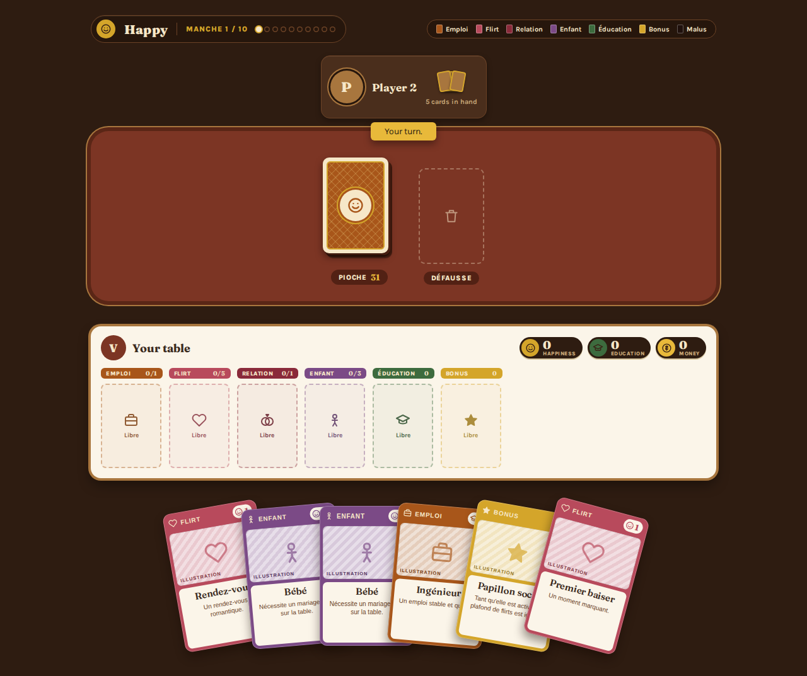

# Happy Card Game

A small web card game, inspired by the "Happy Smile" board game, for 2-4 friends. No accounts, no matchmaking, no setup friction — one invite link, then play.



## Stack

- **Client** — Angular SPA (standalone components, signals)
- **Server** — Node.js + raw `ws` WebSocket backend, the sole source of truth for game state
- **Shared** — the WS protocol and card model, typed once and imported by both sides

The server holds all game state in memory; the client only sends intents and renders what the server broadcasts, with optimistic local updates that roll back on server disagreement. Full write-up in [`aidd_docs/memory/architecture.md`](aidd_docs/memory/architecture.md).

## Getting started

```bash
pnpm install
pnpm dev:server   # terminal 1 — WS backend on :8080
pnpm dev:client   # terminal 2 — Angular dev server on :4200
```

Open http://localhost:4200, create a room, and share the invite link with 1-3 friends.

## Testing

```bash
pnpm test   # runs every package's suite (client, server, shared)
```

## Project structure

```
client/      Angular SPA — home, lobby, and the game board
server/      room lifecycle and the authoritative game engine
shared/      WS protocol + card model, imported by client and server
aidd_docs/   project memory, specs, and task plans (see CONTRIBUTING.md)
```

## Status

MVP complete: room creation/join via invite link, a live lobby roster, and the full game loop (play / discard / use-malus, table rules, live resource scoring, game-over ranking) with optimistic client-side updates.
