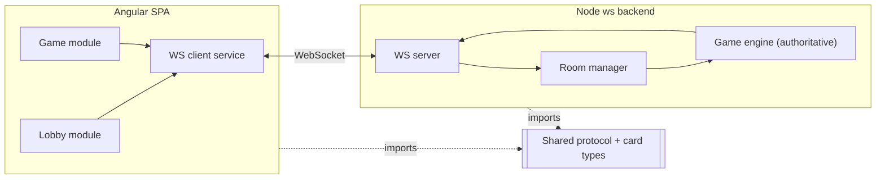

# INSTALL.md - `happy-card-game`

Technical vision and installation guide.

## Vision

A small web card game (no canvas), inspired by the "Happy Smile" board game.

Playable by 2-4 friends in a casual session started via an invitation link — no accounts, no signup, no lobby browsing. The core differentiator is doing the game rules properly with a genuinely great UI/UX, while keeping card variants (types defined upfront) configurable for later expansion rather than hardcoding a single ruleset.

## Decisions

| Decision           | Choice                                  | Why                                                                                                   |
| ------------------- | ---------------------------------------- | ------------------------------------------------------------------------------------------------------ |
| Architecture       | Monolith (thin Node service + Angular SPA) | Real-time + low latency requirement, tiny volume, single dev — heuristic rules out microservices here  |
| Front-end          | Angular SPA (standalone components)      | Team already knows Angular/TypeScript well; no SEO need so no SSR required; mobile responsive covers the "web + mobile" target |
| Back-end           | Node.js + TypeScript, raw `ws`           | Near-zero HTTP surface (WS messages only) makes a routing framework (NestJS/Hono) dead weight; keeps the explicit "keep it simple" constraint |
| Database           | None (in-memory only)                    | No persistence requirement, no data sensitivity, ephemeral rooms — a DB would add ops burden for zero benefit |
| Auth               | N/A                                      | No accounts, no multi-tenant — room access is via invite link/code only                                |
| Hosting            | Local (dev machine) for now              | Zero hosting budget stated; revisit (Render / self-hosted VPS) once ready to share beyond localhost     |

## Stack summary

- **Front-end:** Angular (latest stable), standalone components, mobile-responsive layout
- **Back-end:** Node.js (LTS) + TypeScript, `ws` library, no framework
- **Database:** None — authoritative game/room state held in server memory only
- **Auth:** N/A — invite link/code grants room access
- **Hosting:** Local-only for now; candidates for later are Render (free tier, cold-start trade-off) or a self-hosted VPS
- **Key integrations:** None
- **Package manager:** pnpm workspaces

## Architecture



The Angular client never holds authoritative game state: it sends intents (e.g. "play this card") over the WebSocket and renders whatever the server broadcasts back, with optimistic local updates rolled back if the server disagrees. The Node server is the sole source of truth — its room manager tracks who's in each session, and the game engine enforces the rules and computes the resulting state. Both sides import the same `shared/` protocol and card-type definitions so the WS message contract can't drift between client and server.

## Folder structure

```
happy-card-game/
├── aidd_docs/
│   └── INSTALL.md
├── client/                        # Angular SPA
│   ├── src/
│   │   ├── app/
│   │   │   ├── lobby/              # create/join room screens, invite link
│   │   │   ├── game/                # board, card components, optimistic local updates
│   │   │   ├── core/                 # ws client service, connection/session state
│   │   │   └── shared/                # shared UI bits (buttons, layout)
│   │   ├── assets/
│   │   └── styles/
│   ├── angular.json
│   └── package.json
├── server/                        # Node + ws authoritative backend
│   ├── src/
│   │   ├── rooms/                  # room lifecycle: create, join, invite code
│   │   ├── game/                    # authoritative game engine (rules, card types, state machine)
│   │   ├── ws/                       # connection handling, message routing
│   │   └── index.ts
│   └── package.json
├── shared/                         # types shared client<->server
│   ├── protocol/                    # WS message contract (typed)
│   └── cards/                       # card type definitions (configurable variants later)
├── pnpm-workspace.yaml              # pnpm workspaces root (client, server, shared)
├── package.json
└── README.md
```

## Install steps

Manual install - the framework does not yet scaffold these automatically.

1. `git init` the repo and add a `.gitignore` (Node + Angular).
2. Create `pnpm-workspace.yaml` declaring `client`, `server`, `shared` as workspace packages.
3. Scaffold `client/` with the Angular CLI (`ng new client --standalone --routing`), moved under the workspace.
4. Scaffold `server/` as a plain Node + TypeScript project, add the `ws` dependency.
5. Create `shared/` with the WS message protocol and card-type TypeScript interfaces, referenced by both `client` and `server` via the workspace.
6. Wire the Angular `core` WS client service to connect to the local server's WebSocket endpoint.
7. Run `client` and `server` locally side by side to verify a round-trip WS message (join room → server ack).

## Audit summary

Results of the multi-agent audit run during action 03. Note: candidates A and B were originally scoped around WebRTC P2P; the final design (above) dropped WebRTC entirely in favor of a WebSocket-only authoritative backend, which resolves the NAT/TURN gap flagged below since no P2P connection is attempted.

| Candidate                          | Verdict | Notes                                                                                   |
| ------------------------------------ | ------- | ------------------------------------------------------------------------------------------ |
| A — PeerJS + public broker           | ⚠️      | Mature library, but public broker is SLA-free (reported outages/delays); no TURN, fails on symmetric NAT |
| B — Custom Node+ws (WebRTC signaling) | ⚠️      | Clean tech pairing; no TURN (same NAT gap); Fly.io free tier gone, Render free tier cold-starts |
| C — Firebase RTDB signaling          | ⚠️      | Officially documented pattern, generous free tier; same NAT gap; adds Google/Firebase lock-in |
| **Final — Node+ws, no WebRTC, server-authoritative** | n/a (post-audit pivot) | Eliminates the NAT/TURN gap common to A/B/C entirely by dropping P2P; retains B's already-vetted Node+ws tech, now used for full-session relay instead of just signaling |
