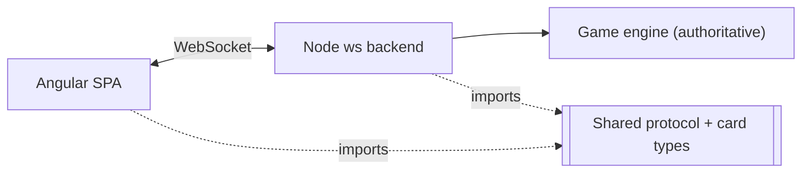

# Architecture

The macro technical shape: the stack, how the pieces fit, and the decisions behind them. Point to the code, do not restate it.

## Stack

- Node.js + TypeScript backend, raw `ws` (no framework) — the WS-only surface is too small for a routing framework (NestJS, Hono) to earn its cost
- Angular SPA frontend (standalone components) — matches the team's existing skillset; no SSR since there's no SEO need
- pnpm workspaces (`client`, `server`, `shared`) — keeps the WebSocket protocol and card-type definitions in one typed source shared by both sides instead of duplicated

## How it fits together

## Key decisions

- The server is the sole source of truth for game state. The client only sends intents and renders what the server broadcasts, applying optimistic local updates that roll back on server disagreement — chosen to avoid host-migration/host-disconnect fragility a peer-held state would have.
- WebRTC (P2P) was considered and dropped. It still needs a signaling channel: a server (defeats the point of going P2P) or manual link exchange (no return path past 2 players without a second round trip). A plain WebSocket relay through a small authoritative backend removes the NAT/STUN/TURN problem entirely instead of working around it.
- No database: room and game state live in server memory only. No persistence requirement, no data sensitivity, and sessions are short-lived.
- No auth provider: room access is granted purely by holding the invite link/code.

## Gotchas

- State is memory-only on the server, so a server restart drops every in-progress room. Acceptable at the current volume and budget — revisit before treating any room as durable.
