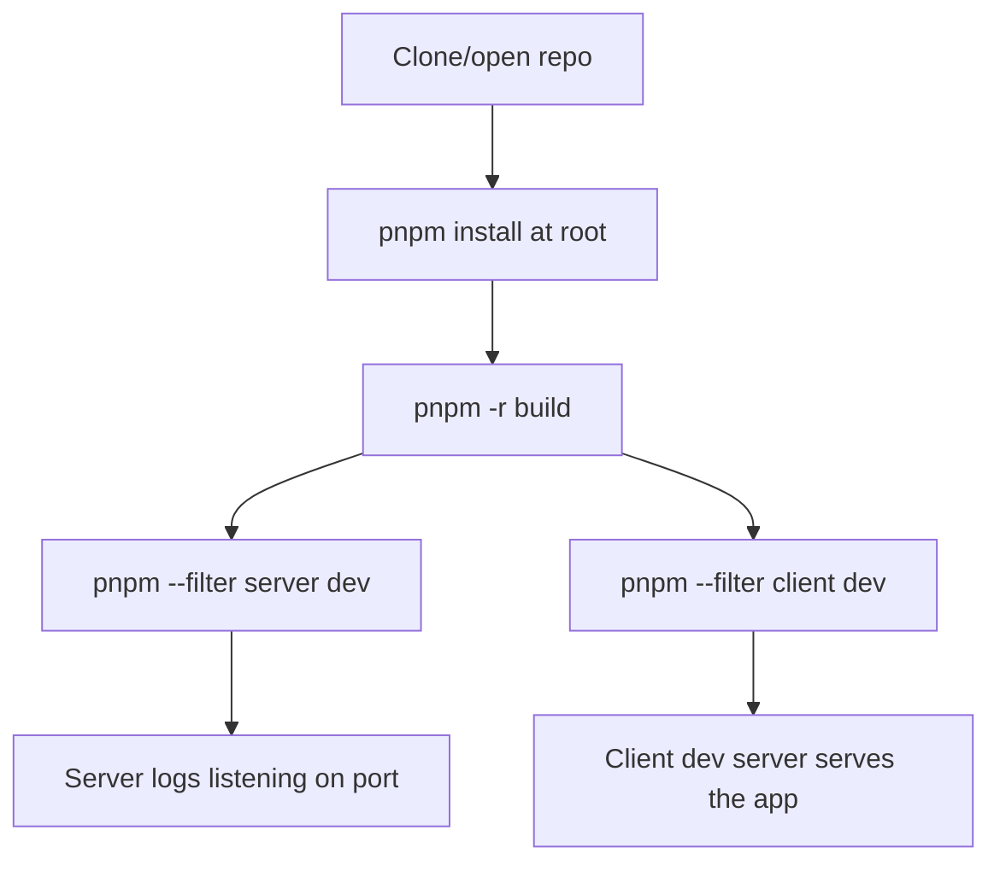
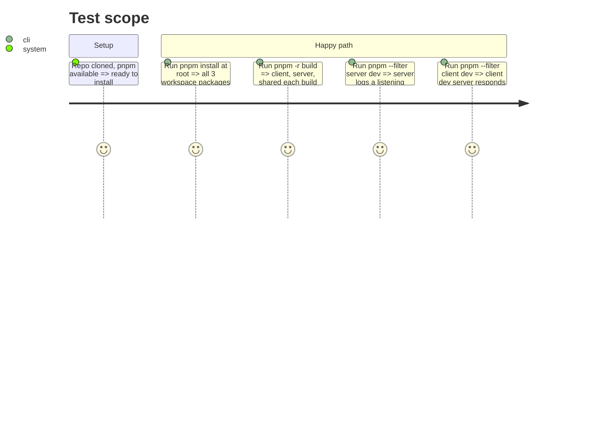

# Instruction: Workspace scaffold

## Architecture projection

> Tree of the final files. ✅ create · ✏️ modify · ❌ delete

```txt
.
├── pnpm-workspace.yaml            ✅
├── package.json                   ✅
├── .gitignore                     ✅
├── client/                        ✅ (Angular CLI skeleton)
│   ├── package.json                ✅
│   ├── angular.json                 ✅
│   └── src/                          ✅
├── server/                        ✅
│   ├── package.json                ✅
│   ├── tsconfig.json                ✅
│   └── src/index.ts                  ✅
└── shared/                        ✅
    ├── package.json                ✅
    ├── tsconfig.json                ✅
    └── src/index.ts                  ✅
```

## User Journey



## Test Scope



## Wireframe

<!-- No UI in this phase. -->

## Tasks to do

### `1)` Root workspace files

> Declare the pnpm workspace and shared root config.

1. Create root `package.json` (`private: true`, name, no dependencies of its own yet).
2. Create `pnpm-workspace.yaml` with `packages: ['client', 'server', 'shared']`.
3. Create root `.gitignore` covering `node_modules/`, `dist/`, `.angular/`, `*.log`.

### `2)` Shared package skeleton

> A minimal buildable TypeScript package the other two will import.

1. `shared/package.json`: name `@happy-card-game/shared`, `main`/`types` pointing at a `dist/` build.
2. `shared/tsconfig.json`: strict TypeScript, declaration output.
3. `shared/src/index.ts`: a placeholder export (real protocol/card types land in phase 2).

### `3)` Server package skeleton

> A minimal Node + TypeScript project with `ws` installed, no logic yet.

1. `server/package.json`: name `@happy-card-game/server`, add `ws`, `typescript`, `@types/ws`, `@types/node` as dependencies/devDependencies, a `dev` script.
2. `server/tsconfig.json`: strict, targets a Node LTS version, references `shared`.
3. `server/src/index.ts`: start a bare `WebSocketServer` on a configurable port and log once listening. No message handling yet.

### `4)` Client package skeleton

> An Angular CLI project generated so it lives cleanly as a pnpm workspace member.

1. Generate `client/` with the Angular CLI (`ng new client --standalone --routing --package-manager=pnpm`), run from the repo root so it lands directly under `client/`.
2. Confirm `client/package.json` is recognized as a workspace member (no separate root install step required for it).
3. Verify `pnpm --filter client run build` succeeds with the default generated app.

### `5)` Root convenience scripts

> One place to run everything during development.

1. Add root `package.json` scripts: `build` (`pnpm -r build`), `dev:server`, `dev:client`, `test` (`pnpm -r test`).

### `6)` Test tooling

> Vitest everywhere, decided by the user — wire it in now so every later phase can add tests as it goes.

1. Add `vitest` as a devDependency in `shared` and `server`; add each package's `test` script (`vitest run`).
2. Add a trivial passing test in each (e.g. `shared`: a smoke test importing the barrel; `server`: a smoke test asserting the module loads) so the runner is proven wired, not just installed.
3. For `client`, wire Vitest as the Angular unit-test runner (Angular's Vitest builder) rather than the CLI's default Karma/Jasmine setup.

## Test acceptance criteria

| Task | Acceptance criteria                                                              |
| ---- | ----------------------------------------------------------------------------------- |
| 1... | `pnpm install` at the repo root completes with no error and links all 3 packages    |
| 2... | `pnpm --filter @happy-card-game/shared build` produces a `dist/` with no error      |
| 3... | `pnpm --filter server dev` prints a "listening" log and stays running               |
| 4... | `pnpm --filter client build` produces a production build with no error              |
| 5... | `pnpm build` and `pnpm test` at the root each run across all 3 packages in one command |
| 6... | `pnpm --filter shared test` and `pnpm --filter server test` each pass their smoke test; `pnpm --filter client test` runs via Vitest |
