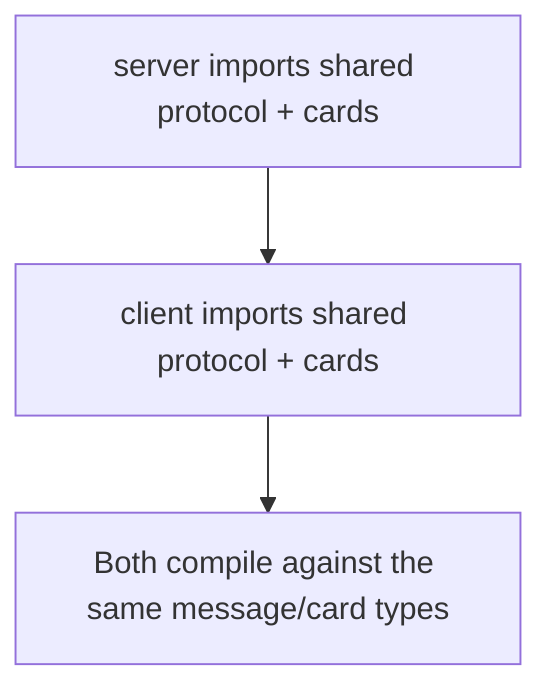
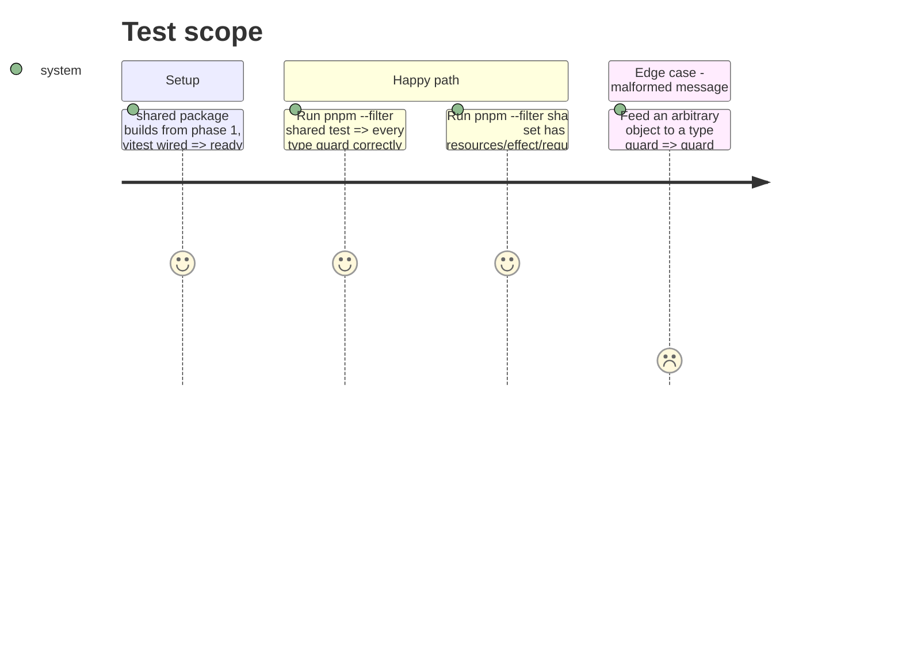

# Instruction: Shared protocol & card model

## Architecture projection

> Tree of the final files. ✅ create · ✏️ modify · ❌ delete

```txt
.
└── shared/
    └── src/
        ├── protocol/
        │   ├── messages.ts      ✅
        │   └── guards.ts         ✅
        ├── cards/
        │   ├── card.ts           ✅
        │   └── baseSet.ts         ✅
        └── index.ts             ✏️
```

## User Journey



## Test Scope



## Wireframe

<!-- No UI in this phase. -->

## Tasks to do

### `1)` WS message protocol

> One discriminated union per direction, `type` as the tag.

1. Define client→server messages in `protocol/messages.ts`: `CreateRoom`, `JoinRoom { code }`, `StartGame`, `TakeTurnAction { cardId, action: 'play' | 'discard' | 'malus', source?: 'hand' | 'table', handCardId?: string, targetPlayerId?: string }`, `LeaveRoom`.
   - The server auto-draws for the active player at turn start; drawing is never a client-initiated message.
   - `source` is only meaningful when `action` is `'discard'` (defaults to `'hand'`) — a player may discard from their own table, not just their hand.
   - `handCardId`: **required** when `action` is `'discard'` and `source` is `'table'` — confirmed rule: a table-discard is a combo, the named table card AND this hand card are discarded together in the same action, atomically. This is what keeps "hand always ends the turn at 5" true even for a table-discard (nothing else about the turn removes a card from hand in that case). Absent/invalid `handCardId` on a table-discard is a full rejection, no partial state change.
   - `targetPlayerId` is only meaningful when `action` is `'malus'`.
2. Define server→client messages: `RoomState { code, players, hostId }`, `GameState { hand, table, playedCards, turnPlayerId, roundsRemaining, deckCount, resources, opponents, result? }`, `ActionRejected { reason }`, `Error { message }`.
   - `table` is per-player: each player's own array of active `CardInstance`s (what's currently placed, after any upgrade replacements or table discards). A `CardInstance { instanceId, definitionId }` is one physical copy — `instanceId` is what protocol actions target, `definitionId` references a `CardDefinition.id`. Named distinctly (not `cardId` on both) so it's never confused with `TakeTurnAction.cardId`, which targets an `instanceId`.
   - `resources` is a live total per player per resource kind, always derived from what is currently on their table — never a one-way banked counter, since a table discard or an upgrade replacement removes a card's contribution.
   - `opponents`: every other seated player's public state — `{ playerId, handCount, table, resources }`. Never their hand contents, since only counts are public per the wireframe; their table and resources are public to everyone.
   - `result?`: present only once the game has ended — `{ rankings: { playerId, happiness }[] }`.
   - `playedCards`: an array of `{ playerId, card: CardInstance }` — attributed per seat, not a bare `CardInstance[]`, so the client can render each played card in the right seat's slot (phase 6's played-cards row).
3. Export a `ClientToServerMessage` and `ServerToClientMessage` union type.

### `2)` Type guards

> Runtime safety at the WS boundary — never trust a parsed JSON blob.

1. Write one `isXxx` guard per message type in `protocol/guards.ts`, checking the `type` field and required properties.
2. Each guard returns `false` on a malformed input rather than throwing.

### `3)` Card model

> Every card belongs to a category and can carry resources, table constraints, an upgrade relationship, a passive bypass effect, or an instant malus effect — all optional, since most cards use only a few of these. The vocabulary is fixed here; per-card content (categories, caps, exact values) can grow later without touching the engine.

1. In `cards/card.ts`, define:
   - `ResourceKind`: `'happiness' | 'education' | 'money'` (extend this union, not the engine, to add a new resource).
   - `CardEffectKind`: instant, one-off malus effects (e.g. `malus-skip-turn`, `malus-force-discard`, `malus-steal-card`), resolved against a target and then discarded — distinct from the passive bypass fields below.
   - `CardDefinition { id, name, category, resources?: Partial<Record<ResourceKind, number>>, maxOnTable?: number, requires?: string[], excludedBy?: string[], upgrades?: string[], bypassExclusion?: string[], bypassCap?: string[], effect?: CardEffectKind, description }`.
     - `category`: a plain string (`'job'`, `'relationship'`, `'flirt'`, `'bonus'`, ...) — the axis every table-constraint check keys on.
     - `maxOnTable`: the cap on simultaneous cards of this category on one player's table (e.g. `'job'` → 1, `'flirt'` → 5); `undefined` means unlimited.
     - `requires`/`excludedBy`: categories that must be present, or must be absent, on the player's own table for this card to be playable.
     - `upgrades`: categories or ids this card replaces on the table when played — the replaced card is discarded, its resources stop counting (confirmed: upgrade replaces entirely, not stacked).
     - `bypassExclusion`/`bypassCap`: while this card remains active on the player's table, the named categories' `excludedBy`/`maxOnTable` checks are ignored for that player (this is the "infidelity lets you play flirts despite married" and "a bonus overrides the flirt cap of 5" mechanic).
2. In `cards/baseSet.ts`, list an initial `BASE_CARD_SET: CardDefinition[]` — a starter mix across a few categories (at least one capped category, one exclusion pair, one upgrade pair, one bypass card) so phase 4's engine has real cases to validate against. The deck can hold any number of cards; this set is a seed, not the final content.

### `4)` Barrel export

1. Update `shared/src/index.ts` to re-export `protocol/*` and `cards/*`.

### `5)` Wire the client dependency

> Row 4 of the acceptance table requires the import to actually resolve for `client`, not just `server` — this phase owns that wiring; no later phase does.

1. Add `@happy-card-game/shared` as a `workspace:*` dependency in `client/package.json`, `pnpm install`.
2. Confirm a throwaway import type-checks against `client/tsconfig.app.json` (the real app build config — the root `client/tsconfig.json` has `"files": []` and checks nothing on its own), then remove the throwaway file. Actual usage of these types is phase 5's job; this task only proves the wiring works.

## Test acceptance criteria

| Task | Acceptance criteria                                                                |
| ---- | -------------------------------------------------------------------------------------- |
| 1... | Every message interface compiles and is included in its direction's union type         |
| 2... | Each type guard, run against a valid sample of its own message, returns `true`          |
| 3... | `BASE_CARD_SET` has no duplicate `id`; every entry with an `effect` uses a known `CardEffectKind`; every `requires`/`excludedBy`/`bypassExclusion`/`bypassCap` entry names a category that exists in the set, and every `upgrades` entry names a category **or** id that exists in the set |
| 4... | Both `client` and `server` can `import { ... } from '@happy-card-game/shared'` with no type error |
