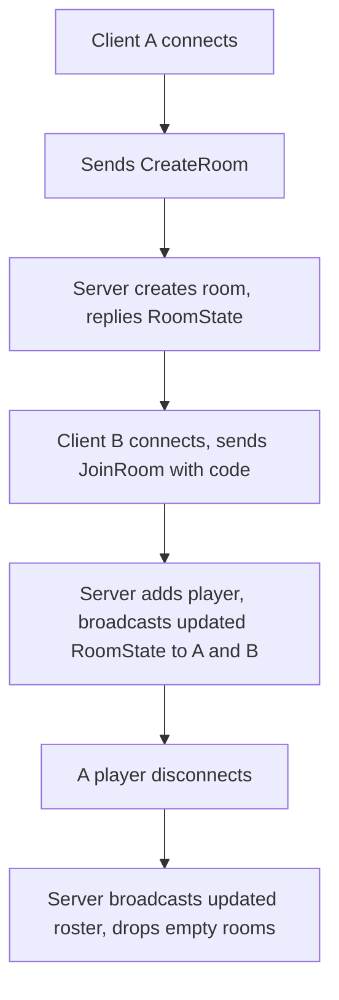
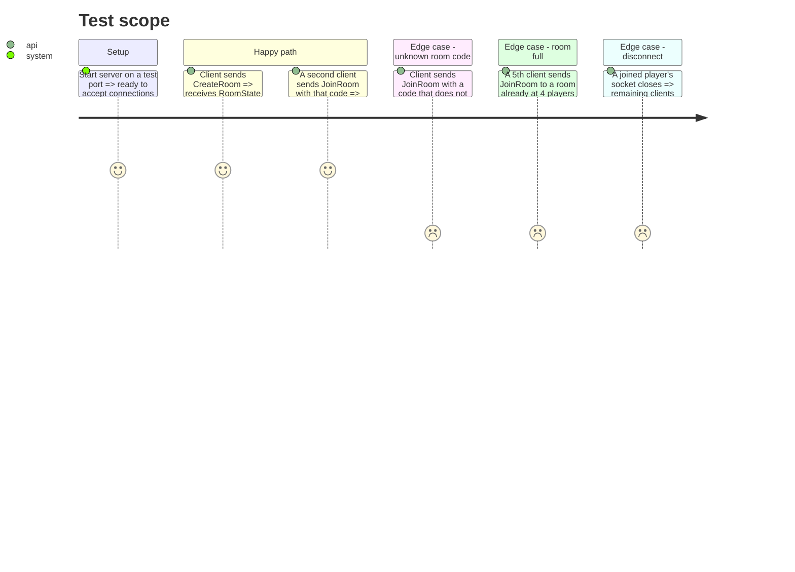

# Instruction: Server room lifecycle

## Architecture projection

> Tree of the final files. ✅ create · ✏️ modify · ❌ delete

```txt
.
└── server/
    └── src/
        ├── rooms/
        │   ├── room.ts           ✅
        │   └── roomManager.ts     ✅
        ├── ws/
        │   ├── connection.ts      ✅
        │   └── router.ts           ✅
        └── index.ts              ✏️
```

## User Journey



## Test Scope



## Wireframe

<!-- No UI in this phase. -->

## Tasks to do

### `1)` Room and RoomManager

> In-memory only, per the architecture decision — no database.

1. `Room`: holds a generated code, `Map<playerId, WebSocket>`, a max of 4 players.
2. `RoomManager`: `createRoom()`, `joinRoom(code, ws)`, `removeConnection(ws)`, a short unique room-code generator.
3. `removeConnection` deletes the room once its last player leaves.

### `2)` WS connection handling and routing

1. On a new connection, assign a `playerId`, hold the socket unassigned to any room until a `CreateRoom`/`JoinRoom` message arrives.
2. Route every parsed, guard-validated message to the matching room action; reject anything a guard fails with an `Error` message.
3. Broadcast `RoomState` to every socket in a room whenever its roster changes.

### `3)` Disconnect handling

1. On socket close, call `removeConnection`, broadcast the updated roster to the room's remaining sockets.

### `4)` Wire the entrypoint

1. `server/src/index.ts`: bring up the HTTP + `WebSocketServer`, instantiate one shared `RoomManager`, attach the connection handler.

## Test acceptance criteria

| Task | Acceptance criteria                                                                          |
| ---- | ------------------------------------------------------------------------------------------------ |
| 1... | `RoomManager.createRoom()` returns a room with a unique code and no players over the max of 4     |
| 2... | A client sending `CreateRoom` then `JoinRoom` from a second client ends with both sockets holding a 2-player `RoomState` |
| 3... | Closing one client's socket results in the other client receiving a `RoomState` with 1 player     |
| 4... | `JoinRoom` with an unknown code, or into a 4-player room, returns `ActionRejected` and changes no state |
