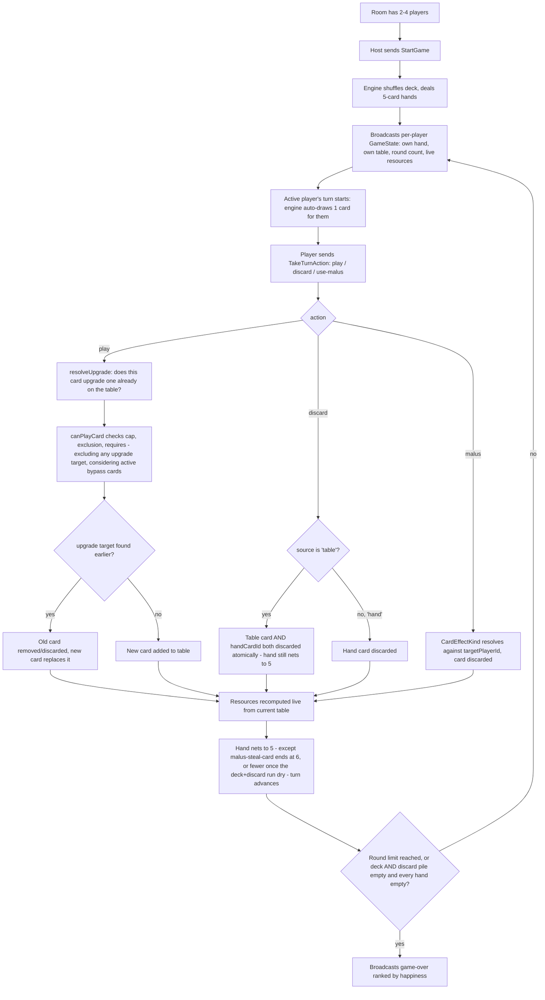
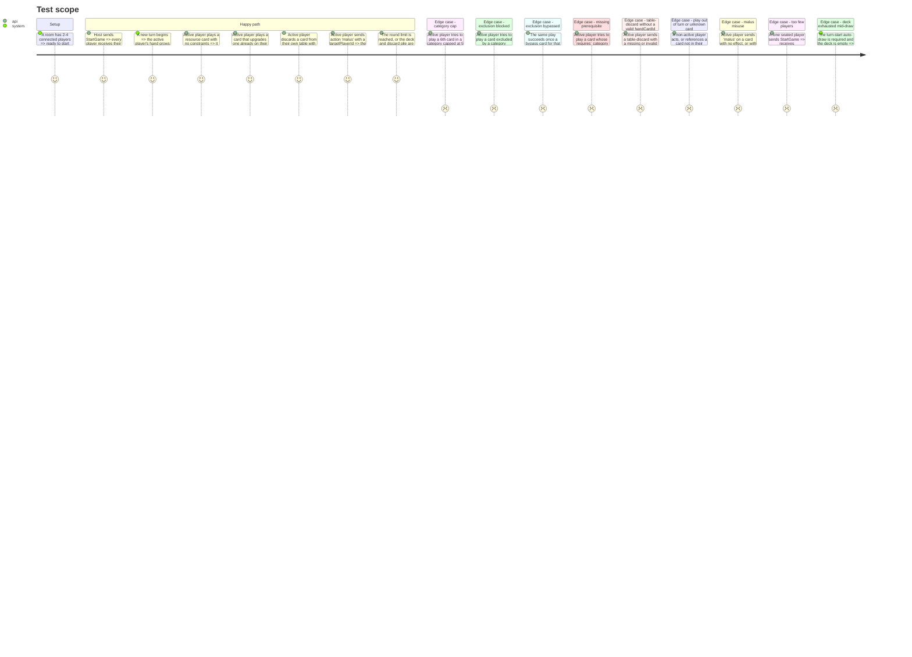

# Instruction: Server authoritative game engine

## Architecture projection

> Tree of the final files. ✅ create · ✏️ modify · ❌ delete

```txt
.
└── server/
    └── src/
        ├── game/
        │   ├── engine.ts          ✅
        │   ├── deck.ts             ✅
        │   ├── tableRules.ts        ✅
        │   ├── scoring.ts            ✅
        │   ├── state.ts               ✅
        │   └── engine.test.ts          ✅ (vitest)
        ├── rooms/
        │   └── room.ts              ✏️ (holds a GameEngine once started)
        └── ws/
            ├── router.ts            ✏️ (handles StartGame, TakeTurnAction)
            └── gameEngine.integration.test.ts ✅ (vitest, real sockets)
```

## User Journey



## Test Scope



## Wireframe

<!-- No UI in this phase. -->

## Tasks to do

### `1)` Deck and state

1. `game/deck.ts`: build and shuffle a deck from `BASE_CARD_SET` (any size), draw, and reshuffle-discard-into-deck when empty.
2. `game/state.ts`: per-room game state — hands (server-side, full; broadcast strips other players' hands to a count), each player's `table: CardInstance[]`, the shared played-cards row as `{ playerId, card }` entries (attributed per seat, per `shared`'s `PlayedCardEntry`), discard pile, turn order index, `roundsRemaining` (from a fixed `MAX_ROUNDS` constant).

### `2)` Table rules

> The constraint checker every `'play'` action goes through before it's accepted.

1. `resolveUpgrade(playerTable, card)` — if `card.upgrades` names a category or id present on the table, returns the old card that would be removed (discarded, replaced entirely — confirmed, not stacked). Runs first because `canPlayCard` needs its result.
2. `game/tableRules.ts`: `canPlayCard(playerTable, card, upgradeTarget?)` — resolves the active bypass set first (union of `bypassExclusion`/`bypassCap` from every card currently on the player's table), then checks against the table **with `upgradeTarget` excluded** (a card upgrading its own category must not be blocked by the cap slot it is about to free):
   - Cap: count cards already on the table in `card.category` (excluding `upgradeTarget`); reject if at/over `card.maxOnTable`, unless that category is in the active bypass-cap set.
   - Exclusion: reject if any of `card.excludedBy` is present on the table (excluding `upgradeTarget`), unless that category is in the active bypass-exclusion set.
   - Prerequisite: reject if any of `card.requires` is absent from the table.
   - This ordering matters: a card that both upgrades and shares a capped category with its own target (e.g. a senior-role card upgrading a junior one in the same `maxOnTable: 1` category) must remain playable — `canPlayCard` evaluates the table as it will be *after* the upgrade removal, not before.

### `3)` Scoring

1. `game/scoring.ts`: `computeResources(playerTable)` sums every `ResourceKind` across the player's current table — always derived live, recomputed after every play, upgrade-replacement, or table discard. Never a one-way banked counter.

### `4)` Engine — turn cycle

1. `game/engine.ts`: `startGame(players)` shuffles the deck, deals 5-card hands, sets turn order and `roundsRemaining`.
2. On a turn starting, auto-draw 1 card for the active player (hand becomes 6) before accepting any action.
3. `takeTurnAction(playerId, cardId, action, { source, handCardId, targetPlayerId })`:
   - Rejects if it isn't `playerId`'s turn.
   - `'play'`: `cardId` must be in hand; call `resolveUpgrade` to find the (possibly absent) upgrade target; run `canPlayCard` with that target excluded, reject with the specific reason if it fails; remove the upgrade target from the table when present (discarded); add the card to the table; remove it from hand.
   - `'discard'`: `source` `'hand'` (default) removes `cardId` from hand, no other side effect. `source` `'table'` is a combo: `cardId` must be on the player's table and `handCardId` must be in their hand — reject with no state change if either is missing/invalid; on success remove both (the table card's resources stop counting, the hand card is simply gone) — this is what keeps "hand always ends the turn at 5" true here too.
   - `'malus'`: reject with `not-a-malus-card` if the card holds no `effect`; reject with `missing-target` if `targetPlayerId` is missing or invalid (these are distinct reasons, not merged). Remove the malus card from the actor's hand **before** resolving the effect — a self-target (`targetPlayerId === playerId`) mutates the same hand array inside effect resolution, and removing the malus card after that would corrupt indices (duplicate or destroy a card). Then resolve the `CardEffectKind` against the target and discard the malus card.
   - After any of the three, recompute the acting player's resources via `computeResources`, confirm hand is back to 5, advance the turn.
4. After each completed turn, decrement `roundsRemaining` once every player has gone; end the game when it hits 0, or immediately if the deck and discard pile are both empty and every hand is empty.
5. On end, rank every player by their live `happiness` resource into the `GameState.result.rankings` field (shared/protocol) and mark the state finished.

### `5)` Wire into room + router

1. `Room` holds an engine instance once `StartGame` is received.
2. `router.ts` handles `StartGame` and `TakeTurnAction`, replying `ActionRejected` (naming the specific rule broken: cap, exclusion, prerequisite, wrong turn, unknown card, missing target, not a malus card, missing hand card, game over) for anything the engine reports. `StartGame` also rejects with fewer than 2 players seated.
3. On every accepted action (including the automatic turn-start draw), broadcast each player their own `GameState`, including their live `resources`, their `table`, and an `opponents` array (each other seated player's `handCount`, public `table`, and `resources` — never their hand contents).

### `6)` Tests

1. `game/engine.test.ts` (Vitest): cover the happy-path turn cycle, an upgrade replacement, a table-discard combo, both end conditions, and every edge case from the Test Scope above (cap, exclusion, exclusion-bypassed, missing prerequisite, table-discard with a missing/invalid handCardId, wrong turn/unknown card, deck reshuffle).

## Test acceptance criteria

| Task | Acceptance criteria                                                                                             |
| ---- | --------------------------------------------------------------------------------------------------------------------- |
| 1... | Drawing from an empty deck reshuffles the discard pile and succeeds instead of failing                                 |
| 2... | `canPlayCard` rejects a capped or excluded play with no active bypass, and accepts the same play once a matching bypass card is on the table |
| 3... | `computeResources` reflects exactly the cards currently on the table — a table discard or upgrade-replacement changes it on the next call |
| 4... | Playing an upgrade card removes the old card's contribution entirely and leaves only the new card's; every accepted action (including a table-discard combo) leaves the acting player's hand at exactly 5 cards, with two documented exceptions: `malus-steal-card` ends at 6 (gaining a card is that effect's entire purpose), and any turn where the auto-draw is skipped because the deck and discard pile are both exhausted can end below 5 (there's nothing left to draw) |
| 5... | Every rejection names a specific reason (cap / exclusion / prerequisite / wrong turn / unknown card / missing target / not a malus card / missing or invalid handCardId / game over), and rejections change no state |
| 6... | `pnpm --filter server test` passes, covering the happy path, both end conditions, and every edge case above             |
