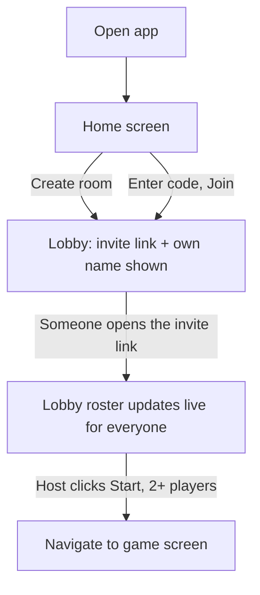
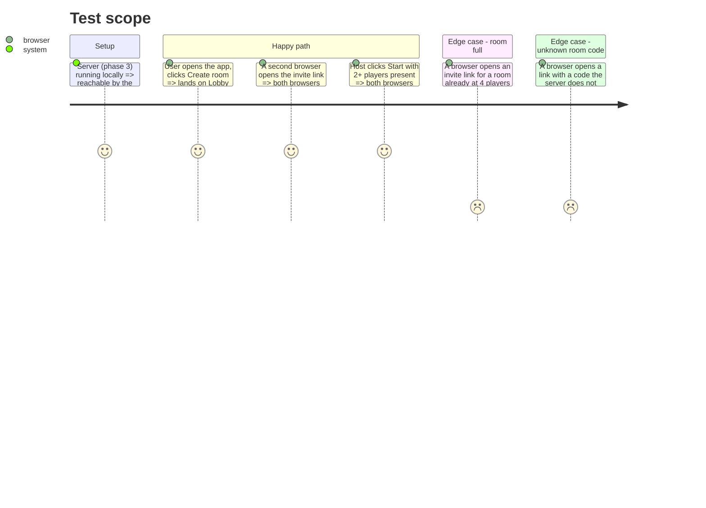

# Instruction: Client Home & Lobby

## Architecture projection

> Tree of the final files. ✅ create · ✏️ modify · ❌ delete

```txt
.
└── client/
    └── src/
        └── app/
            ├── core/
            │   └── ws-client.service.ts   ✅
            ├── lobby/
            │   ├── home.component.ts       ✅
            │   └── lobby.component.ts       ✅
            └── app.routes.ts               ✏️
```

## User Journey



## Test Scope



## Wireframe

```txt
Home:
┌───────────────────────────────────┐
│ (1) Header: game title/logo        │
├───────────────────────────────────┤
│                                    │
│   (2) Create room button           │
│   (3) Join room input + button     │
│                                    │
└───────────────────────────────────┘
1. Header: game name, no nav needed (no accounts).
2. Create room: starts a new session, generates invite link.
3. Join room: paste/enter a room code if not arriving via link directly.

Lobby:
┌───────────────────────────────────┐
│ (1) Header: room code              │
├───────────────────────────────────┤
│ (2) Invite link + copy button      │
├───────────────────────────────────┤
│ (3) Player list (2-4 slots)        │
│  ┌─────────┐ ┌─────────┐           │
│  │ (4) slot│ │ (4) slot│  ...      │
│  └─────────┘ └─────────┘           │
├───────────────────────────────────┤
│ (5) Start game button              │
└───────────────────────────────────┘
1. Header: shows room code for reference.
2. Invite: shareable link, one-tap copy.
3. Player list: live roster as people join via the link.
4. Slot: one joined player, or an empty waiting slot.
5. Start: enabled once minimum players (2) present.
```

## Tasks to do

### `1)` Core WS client service

> One typed connection point the rest of the app uses.

1. `core/ws-client.service.ts`: opens the WebSocket to the server, exposes `send<T extends ClientToServerMessage>`, and an observable/signal stream of incoming `ServerToClientMessage`s.
2. Exposes a connection-status signal (connecting / open / closed) for the UI to react to.

### `2)` Home screen

1. `lobby/home.component.ts`: a "Create room" button sending `CreateRoom`, and a room-code input + "Join" button sending `JoinRoom`.
2. On receiving `RoomState`, navigate to `/room/:code`.

### `3)` Lobby screen

1. `lobby/lobby.component.ts`: reads the room code from the route, renders the invite link (`origin + /room/:code`) with a copy-to-clipboard button.
2. Renders the live player list from the latest `RoomState`.
3. "Start game" button, disabled under 2 players, sends `StartGame`.

### `4)` Routing

1. `app.routes.ts`: `/` → Home, `/room/:code` → Lobby, `/room/:code/play` → game screen (stub route target for phase 6).

## Test acceptance criteria

| Task | Acceptance criteria                                                                        |
| ---- | ---------------------------------------------------------------------------------------------- |
| 1... | The WS client service delivers a parsed, type-guarded message for every server broadcast        |
| 2... | Clicking "Create room" results in navigation to `/room/:code` with a real generated code         |
| 3... | Two browsers on the same room code see each other appear in the player list within one broadcast |
| 4... | Clicking Start with 2+ players present navigates every connected browser to the game route       |
