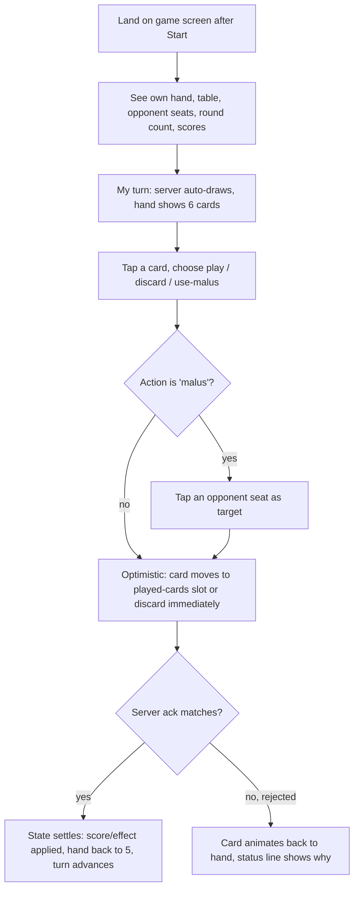
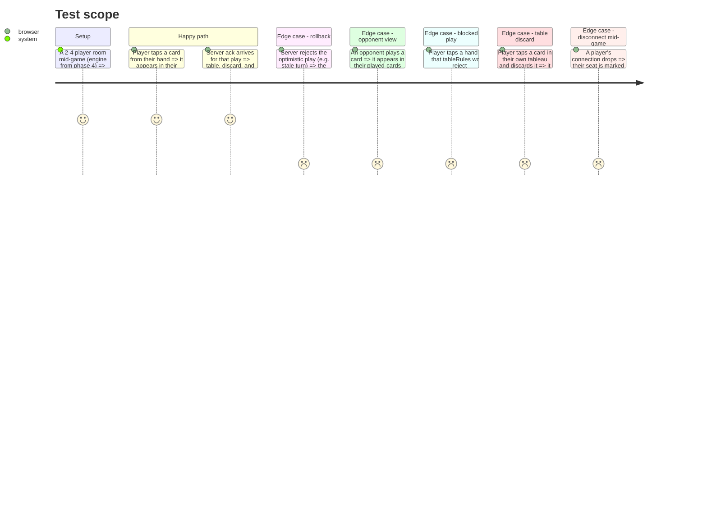

# Instruction: Client game board + optimistic sync

## Architecture projection

> Tree of the final files. ✅ create · ✏️ modify · ❌ delete

```txt
.
└── client/
    └── src/
        └── app/
            └── game/
                ├── game-board.component.ts   ✅
                ├── hand.component.ts          ✅
                ├── table.component.ts          ✅
                ├── tableau.component.ts        ✅
                └── opponent-seat.component.ts   ✅
```

## User Journey



## Test Scope



## Wireframe

```txt
┌─────────────────────────────────────────────┐
│         (1) Opponent (top) + (2) tableau      │
│                ┌────────┐                     │
│                │  (2)   │                     │
│                └────────┘                     │
├──────────┬─────────────────────┬──────────────┤
│  (1)     │     (3) Table        │    (1)      │
│ Opponent │  ┌──────┐ ┌───────┐  │  Opponent   │
│ (left)   │  │ Deck │ │Discard│  │  (right)    │
│  (2)     │  └──────┘ └───────┘  │    (2)      │
├──────────┴─────────────────────┴──────────────┤
│ (4) Played-cards row — one slot per seat       │
│   [ P1 ]   [ P2 ]   [ P3 ]   [ P4 ]            │
├─────────────────────────────────────────────────┤
│ (5) Status line                                  │
├─────────────────────────────────────────────────┤
│ (6) Your tableau — cards on your table, by category│
│   [ job ]  [relationship]  [flirt][flirt][flirt]   │
├─────────────────────────────────────────────────┤
│ (7) Your hand — 5 cards                          │
└───────────────────────────────────────────────────┘
1. Opponent seat (top/left/right): 1-3 shown depending on room size; seats reposition based on player count.
2. Opponent indicator: name + turn marker + a compact tableau summary (category icons/counts); their hand stays face-down, count only — their tableau is public, their hand never is.
3. Table: shared draw deck and discard pile, same for every player.
4. Played-cards row: each seated player's card for the current turn, revealed face-up with its bonus/malus effect once played.
5. Status line: whose turn, round count, your live resources (happiness/education/money), last effect resolved, optimistic/rollback feedback.
6. Your tableau: your own active table cards grouped by category; a category at its cap (unless bypassed) is visibly marked; tap a card here to discard it from the table.
7. Your hand: your 5 cards face-up, tap to choose play / discard / use-malus.
```

## Tasks to do

### `1)` Game board layout

> Assemble the wireframe: opponent seats (with tableau summary) sized to room count, table, played-cards row, status line, your tableau, hand.

1. `game-board.component.ts`: lays out up to 3 `opponent-seat` components (top/left/right, based on player count), `table.component.ts`, the played-cards row, a status line, `tableau.component.ts` (yours), and `hand.component.ts`.
2. `tableau.component.ts`: renders the local player's table cards grouped by category; tapping one offers a table discard.

### `2)` Hand interaction with optimistic update

1. `hand.component.ts`: tapping a card offers the three actions (play / discard / use-malus). Before offering 'play', run the same `tableRules.canPlayCard` check client-side (mirroring phase 4's logic against the locally known tableau) to disable it with a reason when it would be rejected — this is a UX shortcut, the server check in phase 4 remains the source of truth.
2. Choosing 'use-malus' prompts tapping an opponent seat as the target.
3. On confirming an action, the board immediately renders the result optimistically (card into the played-cards slot and tableau for 'play', into hand-discard or off the tableau for 'discard', or an effect indicator on the target seat for 'malus') and removes it from hand, before any server response.
4. Track the pending optimistic action so it can be reverted if rejected.

### `3)` State reconciliation

1. On each authoritative `GameState` broadcast, reconcile: if it confirms the pending action, clear the pending flag and apply the settled state (tableau, resources, turn); if it rejects it (`ActionRejected` for that action), revert the tableau/hand to their pre-optimistic shape and surface the reason on the status line.
2. Render opponents' plays, tableau changes, and turn changes purely from broadcasts — no optimism needed for anyone but the local player.

### `4)` Disconnect / game-over handling

1. Mark an opponent seat as disconnected when the roster (from phase 3/5's `RoomState`) drops them mid-game.
2. Render the game-over result from the engine's finished `GameState` (phase 4).

## Test acceptance criteria

| Task | Acceptance criteria                                                                                 |
| ---- | --------------------------------------------------------------------------------------------------------- |
| 1... | The board renders the correct number of opponent seats for a 2, 3, and 4-player room, each with its tableau summary |
| 2... | A play that would be rejected by `tableRules` (cap/exclusion/prerequisite) is shown disabled with a reason before it's attempted; a valid play removes the card from hand and shows it in the tableau and played-cards slot before any server round-trip completes |
| 3... | A rejected action reverts the tableau/hand to their pre-optimistic shape and shows a reason; an accepted action settles into the broadcast state with no visible flicker |
| 4... | A disconnected opponent's seat is visibly marked; a finished game shows the server's happiness ranking to every remaining player |
