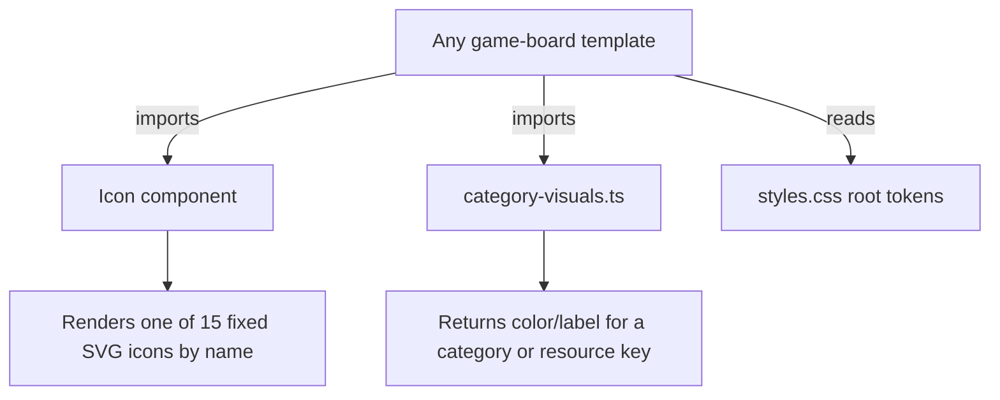

# Instruction: Design system foundations

## Architecture projection

> Tree of the final files. ✅ create · ✏️ modify · ❌ delete

```txt
client/
├── src/
│   ├── index.html                          ✏️ extend Google Fonts weights
│   ├── styles.css                          ✏️ remap :root to dark-wood/felt palette + category/resource tokens
│   └── app/
│       └── game/
│           ├── category-visuals.ts         ✅ category → {color, colorStrong, label} + resource → {color, label}
│           ├── icon.ts                     ✅ closed-set icon component
│           ├── icon.html                   ✅
│           └── icon.css                    ✅
```

## User Journey



## Test Scope

```mermaid
---
title: Test scope
---
journey
  section Setup
    Install Fraunces/Karla weight set in index.html => fonts load without synthetic-bold fallback: browser
  section Happy path
    Render <app-icon name="job"/> => matches the design's briefcase glyph, no console error: browser
    Call categoryColor('flirt') => returns the design's pink (#b84a5c): system
    Render any existing page (home, room) after the token remap => background/ink/border colors switch to dark-wood palette with no layout break: browser
  section Edge case - unknown icon name
    Pass a name outside the fixed union => TypeScript compile error, not a runtime fallback: system
```

## Tasks to do

### `1)` Remap theme tokens

> Swap the parchment palette for the dark-wood/felt palette the artifact uses, keeping every existing token name so `home.css`/`room.css` reskin without edits.

1. In `client/src/styles.css`, replace the `:root` block's values (keep names: `--color-bg`, `--color-surface`, `--color-border`, `--color-border-strong`, `--color-ink`, `--color-ink-muted`, `--color-primary`, `--color-primary-ink`, `--color-gold`, `--color-danger`) with the artifact's wood/felt equivalents (`#3a2416` wood, `#26160c` deep wood, `#f6e7c8` parchment ink, `#e8b93a` gold accent, etc. — pull exact hexes from the artifact markup already read).
2. Add new tokens the board needs beyond the existing set: `--color-felt`, `--color-felt-rail`, category colors (`--cat-job`, `--cat-flirt`, `--cat-relationship`, `--cat-child`, `--cat-education`, `--cat-bonus`, `--cat-malus`, plus each one's paired ink/illustration-tint if the artifact uses one), and resource colors (`--res-happiness`, `--res-education`, `--res-money`).
3. Update `html, body` background in `styles.css` to the new `--color-bg`.

### `2)` Extend loaded font weights

> The design sets Fraunces up to 900 and Karla up to 800; the current link stops short and Angular would synthesize bold instead of using the real cut.

1. In `client/src/index.html`, change the Google Fonts `<link>` `family` query to request `Fraunces:opsz,wght@9..144,500;9..144,600;9..144,700;9..144,900` and `Karla:wght@400;500;700;800`.

### `3)` `category-visuals.ts`

> One source of truth for category → color/label and resource → color/label, so no template hardcodes a hex or a translated string twice.

1. Create `client/src/app/game/category-visuals.ts` exporting a `CATEGORY_VISUALS: Record<string, { color: string; label: string; icon: IconName }>` keyed by the raw `CardDefinition.category` strings already in `baseSet.ts` (`'job'`, `'flirt'`, `'relationship'`, `'child'`, `'education'`, `'bonus'`, `'malus'`), each mapped to its artifact color token and French display label (`'Emploi'`, `'Flirt'`, `'Relation'`, `'Enfant'`, `'Éducation'`, `'Bonus'`, `'Malus'`).
2. Export `RESOURCE_VISUALS: Record<ResourceKind, { color: string; label: string; icon: IconName }>` for `'happiness' | 'education' | 'money'` with English labels (`'Happiness'`, `'Education'`, `'Money'`) — chrome stays English per the plan decision.
3. Export a helper `categoryVisual(category: string)` and `resourceVisual(kind: ResourceKind)` that throw on an unknown key (fail loud, matching `table-rules.ts`'s `getDefinition` pattern) rather than silently falling back.

### `4)` `Icon` component

> A finite, typed icon set — no raw SVG duplicated per template, no `[innerHTML]` sanitization surface.

1. Create `client/src/app/game/icon.ts` with `export type IconName = 'job' | 'flirt' | 'relationship' | 'child' | 'education' | 'bonus' | 'malus' | 'happiness' | 'money' | 'deck' | 'discard' | 'check' | 'upgrade' | 'lock' | 'target'` (trim/extend against what the artifact actually draws), a `name = input.required<IconName>()`, and an optional `size = input<number>(16)`.
2. Create `icon.html` with one `<svg>` per `@case` in a `@switch (name())`, paths copied from the artifact's inline SVGs (stroke `currentColor`, `width`/`height` bound to `size()`).
3. Create `icon.css` only if a shared wrapper style is needed (likely empty/minimal — icons size via the `size` input, not CSS).

## Test acceptance criteria

| Task | Acceptance criteria                                                                                     |
| ---- | ---------------------------------------------------------------------------------------------------------- |
| 1    | `client/src/app/home/home.ts` and `client/src/app/room/room.ts` component tests still pass unmodified — token remap is a pure value swap, no selector or markup change. |
| 2    | `index.html`'s font `<link>` requests the full weight set; no other file changes.                          |
| 3    | `categoryVisual('job')` returns a color + `'Emploi'`; `categoryVisual('nonsense')` throws.                 |
| 4    | `<app-icon name="job" [size]="20" />` renders one `<svg>` sized 20×20; an invalid `name` fails at compile time. |
