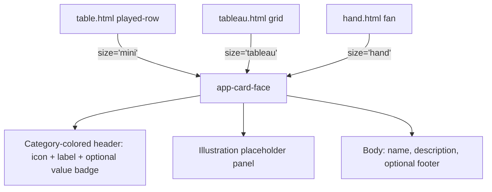
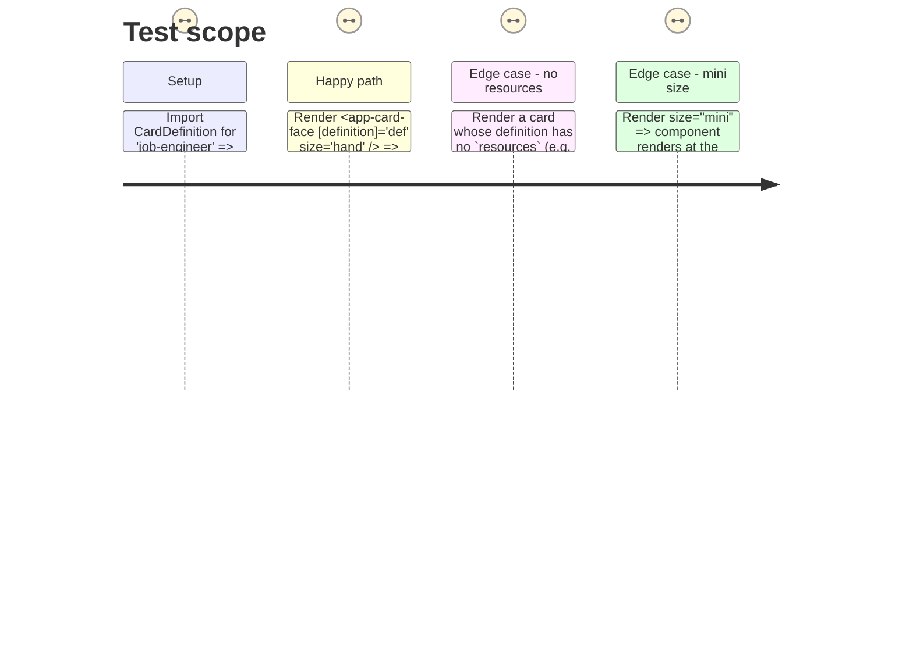

# Instruction: Shared card-face component

## Architecture projection

> Tree of the final files. ✅ create · ✏️ modify · ❌ delete

```txt
client/
└── src/
    └── app/
        └── game/
            ├── card-face.ts             ✅ reusable card visual (size: 'mini' | 'tableau' | 'hand')
            ├── card-face.html           ✅
            └── card-face.css            ✅ per-category color via CSS custom property, not duplicated rules
```

## User Journey



## Test Scope



## Tasks to do

### `1)` Component shape

> One component, one CSS file, sized by a single `size` input rather than three near-duplicate templates.

1. Create `client/src/app/game/card-face.ts`: inputs `definition = input.required<CardDefinition>()`, `size = input<'mini' | 'tableau' | 'hand'>('tableau')`, `footer = input<string | null>(null)` (for tableau's "Salaire max 2" / "Cumulable" style notes), `selected = input<boolean>(false)` (for the hand's gold-glow selected state).
2. Compute the header value badge from `definition().resources` inside the component (e.g. first non-zero resource, or a small ordered list if the artifact shows more than one) — derive, don't require the caller to pass it.
3. Look up header color/icon/label via `categoryVisual(definition().category)` from Phase 1.

### `2)` Template and sizing

1. In `card-face.html`, build the three-part anatomy from the artifact: header (icon + category label + value badge), illustration placeholder (category-tinted diagonal-stripe panel + faint category icon watermark — text "Illustration" placeholder per the artifact, since no real art exists yet), body (name, description truncated to what fits, optional `footer()` line).
2. Drive width/height/font-scale off `size()` via a host class (`.size-mini` / `.size-tableau` / `.size-hand`) rather than three branching templates — one markup structure, three CSS scales.
3. Bind the `selected()` gold-glow box-shadow only for `size="hand"` (the artifact only shows the glow on hand cards).

### `3)` Budget check

1. Keep `card-face.css` under the `anyComponentStyle` 8kB warning threshold (`client/angular.json`) — use the category CSS custom properties from Phase 1 (`--cat-*`) instead of one color rule per category.
2. Run `pnpm --filter client build` (or the project's existing build script) once the component is in place and confirm no budget warning references `card-face`.

## Test acceptance criteria

| Task | Acceptance criteria                                                                                          |
| ---- | ------------------------------------------------------------------------------------------------------------- |
| 1    | `card-face.ts` compiles against every `BASE_CARD_SET` entry (job, flirt, relationship, child, education, bonus, malus) without a runtime throw. |
| 2    | Rendering the same `definition` at all three `size` values produces visually distinct footprints matching the artifact's mini/tableau/hand dimensions (manual/visual check, no automated pixel assertion required). |
| 3    | Production build completes with no `anyComponentStyle` budget warning for `card-face`.                        |
