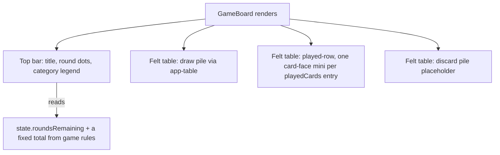
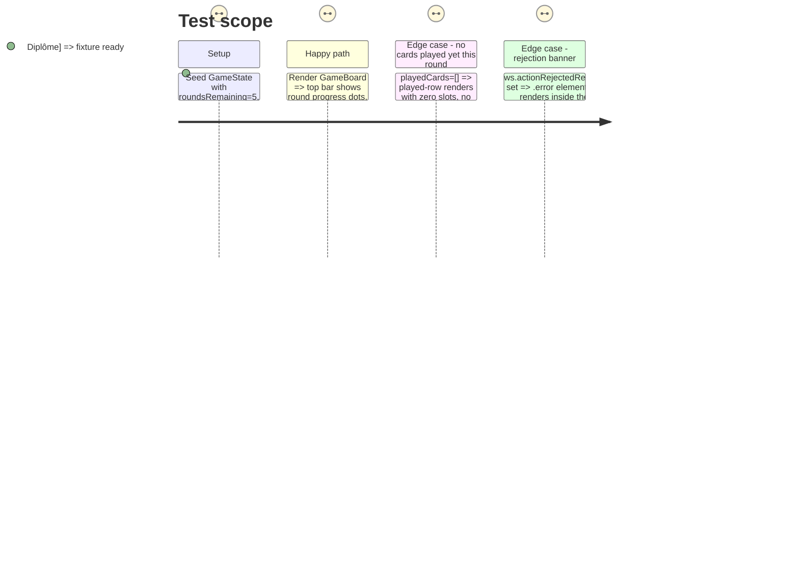

# Instruction: Board chrome & felt table

## Architecture projection

> Tree of the final files. ✅ create · ✏️ modify · ❌ delete

```txt
client/
└── src/
    └── app/
        └── game/
            ├── game-board.ts             ✏️ round-tracker + legend computed values
            ├── game-board.html           ✏️ top bar, felt table region wrapping <app-table> and played-row
            ├── game-board.css            ✏️ wood/felt layout rules
            ├── table.ts                  ✏️ (likely unchanged — deckCount input already sufficient)
            ├── table.html                ✏️ draw pile + discard pile visuals
            └── table.css                 ✏️ felt-rail, pile styling
```

## User Journey



## Test Scope



## Tasks to do

### `1)` Top bar

> Title chip, round-tracker dots, category legend — new to the current board, absent from `game-board.html` today.

1. `MAX_ROUNDS` (`server/src/game/state.ts:4`) isn't exported from `shared`, so the client can't import it directly — but `engine.ts:101` sets `roundsRemaining = MAX_ROUNDS` at game start, strictly before the first decrement at `engine.ts:330`, so the *first* `GameState` a client ever observes always carries the true total. In `game-board.ts`, add a `signal`/`computed` that captures `state.roundsRemaining` the first time `gameState()` becomes non-null and holds it as `totalRounds` for the game's lifetime; derive `roundTrackerDots` from `totalRounds` vs. the current `roundsRemaining` (filled = rounds played, one highlighted = current, remaining = hollow), matching the artifact.
2. In `game-board.html`, add the top bar: title chip (static "Happy" wordmark + happy-face icon, per the artifact), round label (`Manche {{current}} / {{total}}`), the dot tracker, and the category legend (iterate `CATEGORY_VISUALS` from Phase 1, one `<app-icon>` + French label chip per category).
3. Style in `game-board.css`: pill-shaped dark-wood containers, per the artifact's `#26160c` chip background.

### `2)` Felt table region

> Replaces the current plain `<app-table>` + bare `.played-row` with the artifact's felt-textured table holding draw pile, played cards, and a discard pile.

1. Wrap `<app-table [deckCount]="state.deckCount" />` and the played-row inside a new `.felt-table` container in `game-board.html`, styled in `game-board.css` with the artifact's felt background, inset rail shadow, and rounded corners.
2. Rebuild `table.html`/`table.css` for the draw-pile visual (stacked card silhouette + face-down illustration + "Pioche — N cartes" pill) and an empty discard-pile placeholder (dashed outline + `<app-icon name="discard">`), replacing the current plain `.pile` boxes.
3. Replace each `.played-slot`'s inner markup in `game-board.html` with `<app-card-face [definition]="definitionFor(entry.card)" size="mini" />` plus the existing seat label — **keep the `.played-row` and `.played-slot` wrapper classes unchanged** so `game-board.spec.ts`'s `.played-slot` count assertion keeps passing.
4. Keep the `.error` rejection banner and `.status-line` turn text rendering (repositioned visually into/near the top bar or felt table per the artifact's turn ribbon) — **keep the `.error` class name**.

## Test acceptance criteria

| Task | Acceptance criteria                                                                                      |
| ---- | ------------------------------------------------------------------------------------------------------------ |
| 1    | Top bar renders round dots whose filled count matches `roundsRemaining`/total math, and one legend chip per category in `CATEGORY_VISUALS`. |
| 2    | `game-board.spec.ts`'s existing `.played-row` / `.played-slot` assertions (`'settles into the broadcast state…'` test) pass unmodified; draw pile shows `state.deckCount`. |
