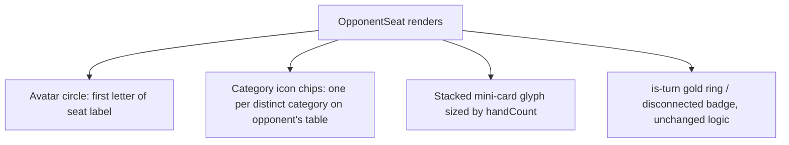
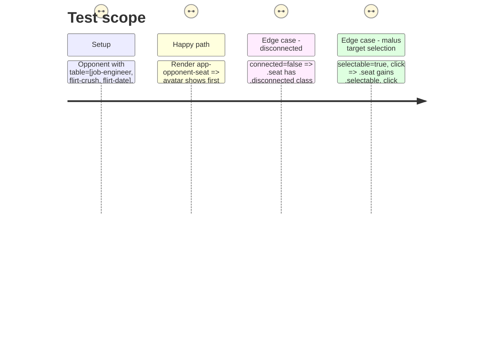

# Instruction: Opponent seats

## Architecture projection

> Tree of the final files. ✅ create · ✏️ modify · ❌ delete

```txt
client/
└── src/
    └── app/
        └── game/
            ├── opponent-seat.ts          ✏️ category chips replace text-pill summary
            ├── opponent-seat.html        ✏️ avatar, chips, stacked mini-card glyph
            └── opponent-seat.css         ✏️ dark-wood seat card, active/disconnected states
```

## User Journey



## Test Scope



## Tasks to do

### `1)` Category chip data

> Swap the current `category × count` text pill for icon chips, reusing Phase 1's visual map instead of raw category strings.

1. In `opponent-seat.ts`, keep the existing `tableauSummary` computed (category + count grouping) unchanged in shape — only how the template renders each entry changes.
2. In `opponent-seat.html`, replace the current `<li>{{ entry.category }} × {{ entry.count }}</li>` list with `<app-icon [name]="categoryVisual(entry.category).icon" />` plus a small count badge for entries with count > 1 (per the artifact's "×2" corner badge on the Flirt chip) — import `categoryVisual` from Phase 1's `category-visuals.ts`.

### `2)` Avatar and hand-count glyph

1. Add an avatar circle (first letter of `seatLabel()`, or of the player's display name if one becomes available later — first letter of the seat label for now) styled per the artifact (solid category-neutral color, gold ring when `isTurn()`, dimmed when `!connected()`).
2. Replace the plain `{{ opponent().handCount }} cards in hand` text with the artifact's stacked mini-card-back glyph (2–3 overlapping rotated rectangles, count capped visually at 3 regardless of actual hand size) plus the existing count text kept alongside it (don't remove the number — it's the only precise signal).

### `3)` State styling parity

1. Port `is-turn` (gold ring + dot), `disconnected` (dimmed avatar + red badge), and `selectable`/hover states from the artifact into `opponent-seat.css`, keeping the exact class names (`is-turn`, `disconnected`, `selectable`) the component and tests already use.

## Test acceptance criteria

| Task | Acceptance criteria                                                                                   |
| ---- | ---------------------------------------------------------------------------------------------------------- |
| 1    | `tableauSummary()`'s existing unit shape is untouched; template renders one icon chip per category, badge only when count > 1. |
| 2    | Avatar renders the seat label's first letter; hand-count number is still present in the DOM text.        |
| 3    | `game-board.spec.ts`'s `'marks an opponent seat disconnected…'` and `'use-malus prompts an opponent target…'` tests pass unmodified. |
