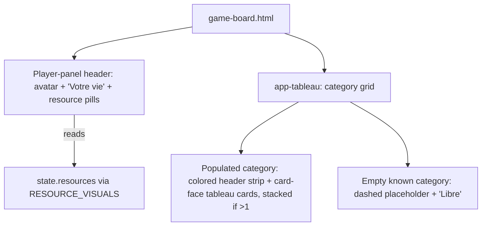
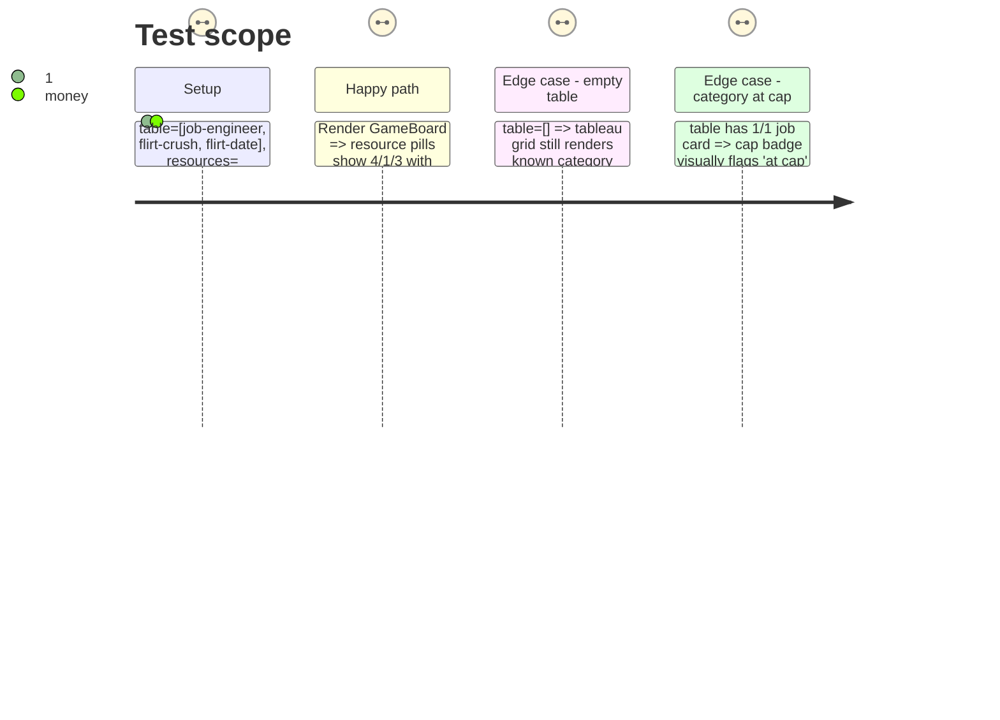

# Instruction: Player panel & tableau

## Architecture projection

> Tree of the final files. ✅ create · ✏️ modify · ❌ delete

```txt
client/
└── src/
    └── app/
        └── game/
            ├── game-board.html           ✏️ player-panel header (avatar + resource pills) wrapping <app-tableau>
            ├── game-board.css            ✏️ panel container styling
            ├── tableau.ts                ✏️ fixed category order incl. empty categories
            ├── tableau.html              ✏️ grid layout, card-face (tableau size), cap badges, empty-slot state
            └── tableau.css               ✏️ category-header strip + grid
```

## User Journey



## Test Scope



## Tasks to do

### `1)` Resource pills header

> Replaces the current plain `.resources` text line (`happiness: 4 education: 1 money: 3`) with the artifact's icon pills, in the player panel rather than inside `Tableau` (per the plan's architecture decision).

1. In `game-board.html`, add a player-panel header block wrapping `<app-tableau>`: avatar (static "V" or first letter of "You"), "Votre vie" title (kept in English chrome per the plan decision — e.g. "Your table"), and one resource pill per `RESOURCE_KINDS` entry using `<app-icon [name]="resourceVisual(kind).icon" />` + the numeric value from `state.resources`.
2. Style pills in `game-board.css` per the artifact: parchment pill on the wood panel, icon token + value/label stack.

### `2)` Tableau category grid

> Currently `Tableau` only renders categories present on the table. The artifact shows all category slots, including empty ones marked "Libre" — decide against `BASE_CARD_SET`'s known categories (`job`, `flirt`, `relationship`, `child`, `education`, `bonus` — `malus` cards don't sit on the table, they resolve instantly, so exclude it from the grid).

1. In `tableau.ts`, change `groups` to iterate a fixed category list (job/flirt/relationship/child/education/bonus, in that order) rather than only categories present on `cards()`, keeping `atCap` computation per category and adding the count/cap fraction (e.g. `"2/5"`) the artifact shows in each header strip.
2. In `tableau.html`, render each category as: colored header strip (`categoryVisual(category).color` background, label, `count/cap` or bare `count` when uncapped) followed by either `<app-card-face [definition]="..." size="tableau" />` per card (stacked with a slight vertical overlap when more than one, per the artifact's flirt-stack) or the empty-slot placeholder (dashed border in the category color, `<app-icon>` watermark, "Libre" text) when the category has zero cards.
3. Re-evaluate whether the top-level `'Your table is empty'` message (currently shown when `groups().length === 0`) still makes sense once every category always renders a slot — most likely remove it, since an all-empty grid already communicates "empty" visually.

### `3)` Keep discard interaction wired

1. Preserve the existing `onCardClick(card)` → `discard.emit(card)` behavior; the click target becomes the `card-face` element (or a thin wrapper button around it) instead of the current plain `.card` button — **keep the `.card` class on whatever element carries the click handler and the `[disabled]` binding**, since `game-board.spec.ts`'s `'a table-discard combo…'` test queries `app-tableau .card`.

## Test acceptance criteria

| Task | Acceptance criteria                                                                                             |
| ---- | ------------------------------------------------------------------------------------------------------------------ |
| 1    | Resource pills render all three `RESOURCE_KINDS` values from `state.resources`, matching current numeric correctness. |
| 2    | Tableau grid shows a header + count/cap for every non-malus category, populated or empty; `atCap` styling still triggers at the same threshold as today's `.badge-cap`. |
| 3    | `game-board.spec.ts`'s `'a table-discard combo pairs the tapped table card…'` and the earlier `'optimistically moves a valid play…'` tests (which assert `app-tableau` text content) pass unmodified. |
