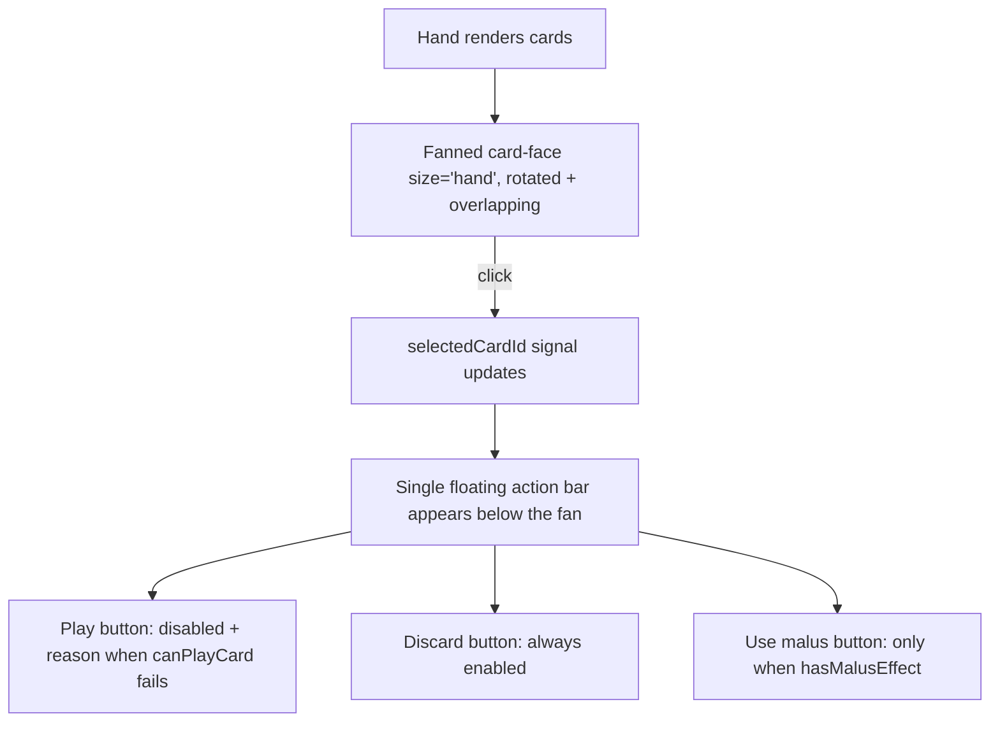
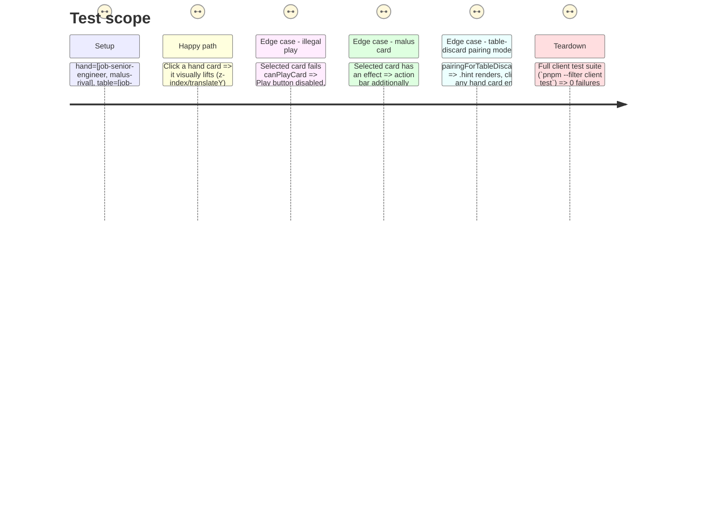

# Instruction: Fanned hand, action bar & regression pass

## Architecture projection

> Tree of the final files. ✅ create · ✏️ modify · ❌ delete

```txt
client/
└── src/
    └── app/
        └── game/
            ├── hand.ts                   ✏️ selection stays the same signal; menu becomes one shared action bar
            ├── hand.html                 ✏️ fanned card-face (hand size), single floating .menu bar
            └── hand.css                  ✏️ fan transform (rotation + negative margin + z-index), action bar
```

## User Journey



## Test Scope



## Tasks to do

### `1)` Fanned hand layout

> Replace the current flex-wrap row of plain card buttons with the artifact's overlapping rotated fan.

1. In `hand.html`, render each hand card as `<app-card-face [definition]="..." size="hand" [selected]="selectedCardId() === card.instanceId" />`, keeping a clickable wrapper around it that carries the `.card` class and click handler (per Phase 5's rule: tests query `app-hand .card`).
2. In `hand.css`, apply the artifact's fan transform per card index: alternating `rotate()` degrees and `translateY()` lift increasing toward the fan's edges, negative left margin after the first card for the overlap, and an ascending `z-index` so the selected/hovered card can visually front itself (`z-index` bump on `:hover`/`.selected` in addition to the base index-driven stacking).
3. Verify overlapping cards remain independently clickable — the overlap is partial (per the artifact, each card's non-overlapped body region stays exposed), so no `pointer-events` workaround should be needed; call this out explicitly during manual QA (task 4) since it's the one interaction risk flagged in the plan.

### `2)` Single floating action bar

> The artifact shows one action bar for the whole hand (not one menu per card slot) — a structural simplification of the current per-slot `.menu`.

1. In `hand.ts`, keep `selectedCardId` as-is; derive a `selectedView = computed(() => this.views().find(v => v.card.instanceId === this.selectedCardId()))` for the bar to read.
2. In `hand.html`, move the `.menu` block out of the per-card `@for` loop to a single element after the fan, rendered `@if (selectedView() && !pairingForTableDiscard())`, containing: the selected card's name, a Play `.btn-outline` (disabled + `.reason` paragraph on failure, exactly as today), a Discard `.btn-outline`, and — only `@if (selectedView().hasMalusEffect)` — a "Use malus" `.btn-outline`. **Keep the `.menu`, `.btn-outline`, `.reason`, and `.hint` class names unchanged.**
3. Style the bar in `hand.css` per the artifact's floating pill (dark-wood background, gold primary Play button, ghost-outline Discard button).

### `3)` Wire remaining click handlers

1. Confirm `onCardClick`, `onPlay`, `onDiscard`, `onUseMalus`, and the `pairingForTableDiscard` branch are unchanged in `hand.ts` — this phase only touches the template/CSS, not the selection logic.

### `4)` Full regression pass

> Close the plan: every phase's "keep this class name" promise gets verified together, once, against the real suite — not phase-by-phase assumption.

1. Run `pnpm --filter client test` — all specs (`game-board.spec.ts`, `table-rules.spec.ts`, `home.spec.ts`, `room.spec.ts`, `ws.service.spec.ts`) must pass with zero edits to the spec files themselves.
2. Run `pnpm --filter client build` (production config) — confirm no `anyComponentStyle` budget warnings across every touched component, and no initial-bundle budget regression from the new fonts/components.
3. Manually load the board (`/run` or `ng serve`) with a seeded multi-player state and check: the hand fan's overlap doesn't block clicks on the card beneath the front one when a different card is selected; the round-tracker dot math matches an actual multi-round game; the discard-pairing flow (tap a tableau card, then a hand card) still completes end to end.

## Test acceptance criteria

| Task | Acceptance criteria                                                                                                    |
| ---- | ---------------------------------------------------------------------------------------------------------------------- |
| 1    | Fan renders with visually distinct, independently clickable cards; no card is fully occluded by its neighbor.          |
| 2    | `game-board.spec.ts`'s `'disables Play with a reason…'`, `'optimistically moves a valid play…'`, and `'use-malus prompts…'` tests pass unmodified against the single-action-bar markup. |
| 3    | No behavior change — verified by the same passing tests as task 2.                                                      |
| 4    | `pnpm --filter client test` and `pnpm --filter client build` both exit 0; manual QA notes (or a short `/run` walkthrough) confirm the fan-click and discard-pairing flows. |
