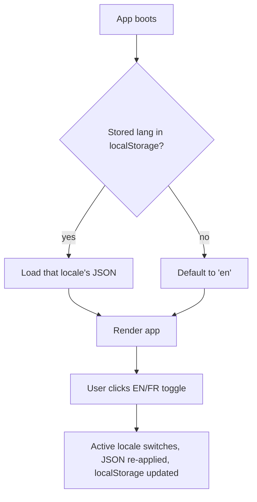
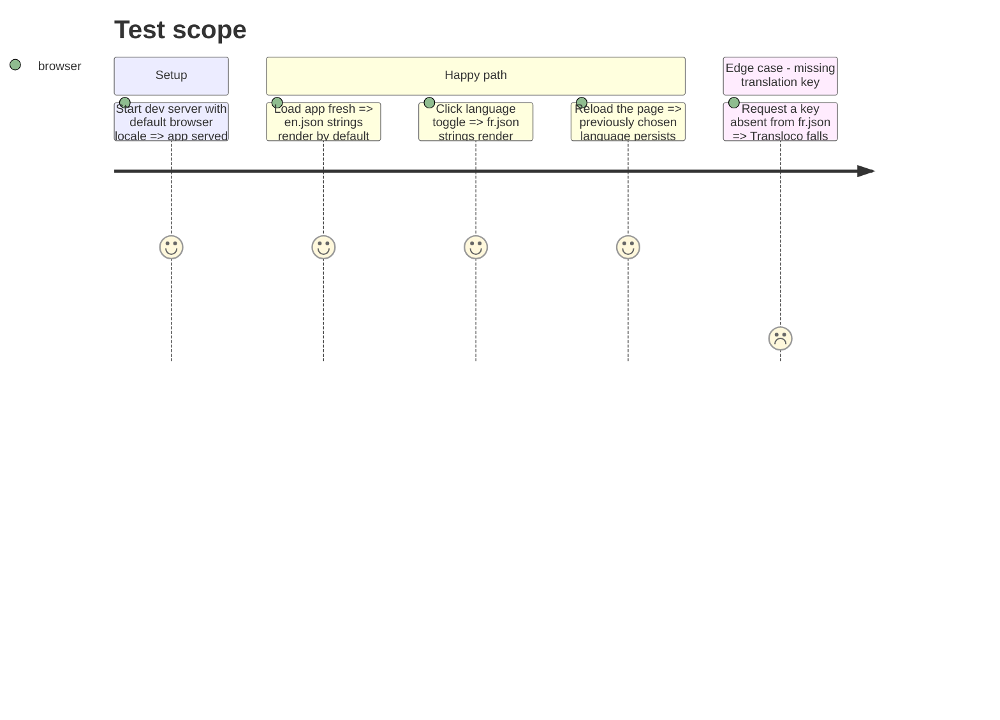

# Instruction: Transloco setup + language switch

## Architecture projection

> Tree of the final files. ✅ create · ✏️ modify · ❌ delete

```txt
.
├── client/
│   ├── package.json                        ✏️ add @jsverse/transloco
│   ├── public/
│   │   └── i18n/
│   │       ├── en.json                     ✅ minimal seed (e.g. app.title)
│   │       └── fr.json                     ✅ minimal seed (e.g. app.title)
│   └── src/app/
│       ├── app.config.ts                   ✏️ register Transloco providers (langs en/fr, http loader over /i18n, localStorage-backed active lang)
│       ├── app.ts / app.html               ✏️ mount a language switcher (EN/FR toggle)
│       └── app.spec.ts                     ✏️ provide TranslocoTestingModule (or equivalent) so existing TestBed setup still boots
```

## User Journey



## Test Scope



## Wireframe

```txt
[Happy]  ...top bar...                          [EN | FR]
```

## Tasks to do

### `1)` Install and configure Transloco

> Get the library wired with two locales loaded from local JSON.

1. `pnpm --filter client add @jsverse/transloco`
2. Create `client/public/i18n/en.json` and `client/public/i18n/fr.json` with a placeholder key (e.g. `{"app": {"title": "Happy Card Game"}}` / `{"app": {"title": "Happy Card Game"}}`) — later phases fill these out.
3. In `client/src/app/app.config.ts`, add `provideTransloco` (or `provideHttpClient` + Transloco's providers) configured with `availableLangs: ['en', 'fr']`, `defaultLang` resolved from `localStorage` (fallback `'en'`), `reRenderOnLangChange: true`, loader pointed at `/i18n/{lang}.json`.
4. Confirm `provideHttpClient` is present (Transloco's default loader needs `HttpClient`) — add it if missing.

### `2)` Language switcher + persistence

> Let the user flip locale at runtime, and remember the choice.

1. Add a small toggle control (two buttons or a select) in `client/src/app/app.html`/`app.ts` — visible on every screen (top-level shell, not per-page).
2. On change, call Transloco's `setActiveLang`, write the choice to `localStorage`.
3. On boot, read `localStorage` before Transloco initializes so the first paint uses the stored locale (no flash of the wrong language).

## Test acceptance criteria

| Task | Acceptance criteria                                                                 |
| ---- | ------------------------------------------------------------------------------------ |
| 1... | `pnpm --filter client build` succeeds; app boots in the browser with no console errors; `/i18n/en.json` and `/i18n/fr.json` are fetched (network tab) |
| 2... | Clicking the toggle changes rendered locale immediately, no page reload; reloading the page keeps the last chosen locale |
