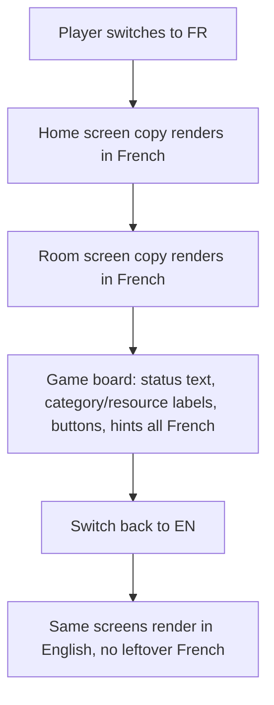
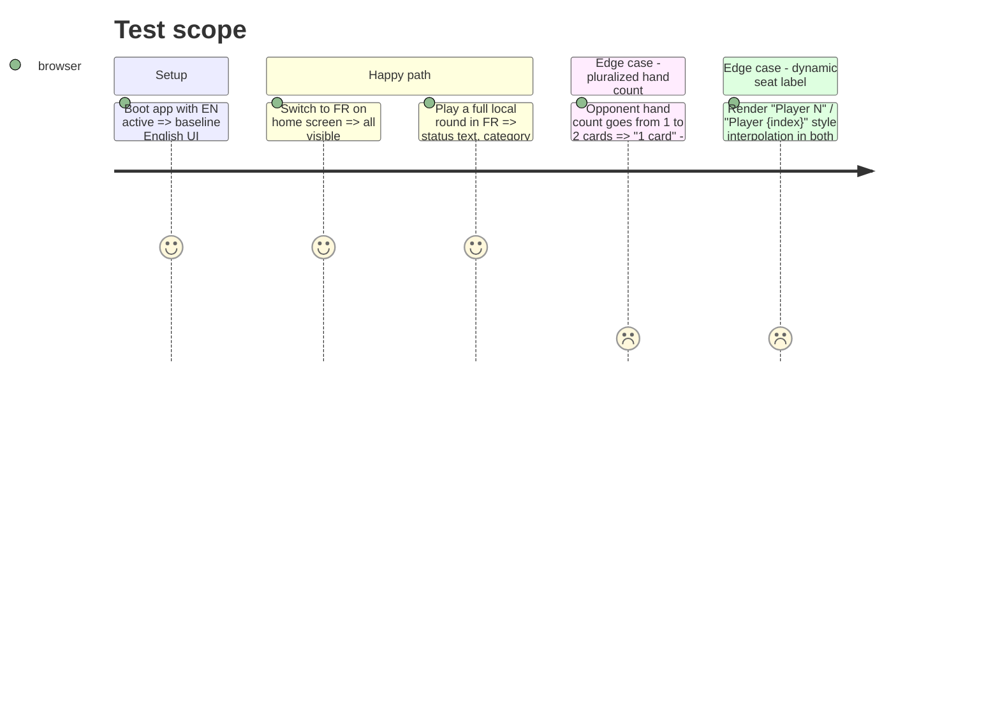

# Instruction: UI copy migration

## Architecture projection

> Tree of the final files. ✅ create · ✏️ modify · ❌ delete

```txt
.
└── client/
    ├── public/i18n/
    │   ├── en.json                          ✏️ full UI dictionary (home, room, game, errors namespaces)
    │   └── fr.json                          ✏️ full UI dictionary (mirror keys, French copy)
    └── src/app/
        ├── home/home.html, home.spec.ts     ✏️ transloco keys + updated assertions
        ├── room/room.html, room.spec.ts     ✏️ transloco keys + updated assertions
        ├── game/game-board.html             ✏️ transloco keys (round label, legend, error area, cancel, final results)
        ├── game/game-board.ts, game-board.spec.ts ✏️ turnStatus()/rankings label/seatLabelFor() return translated strings; assertions updated
        ├── game/opponent-seat.html          ✏️ "disconnected" badge, hand-count string (pluralization)
        ├── game/table.html                  ✏️ "Pioche" / "Défausse" pile labels
        ├── game/hand.html                   ✏️ hint, Play/Discard/Use malus buttons
        ├── game/tableau.html                ✏️ "Libre" empty-slot label
        ├── game/card-face.html              ✏️ "Illustration" placeholder label
        └── game/category-visuals.ts         ✏️ `label` fields become translation keys, resolved via transloco pipe at each call site
```

## User Journey



## Test Scope



## Tasks to do

### `1)` Build the UI dictionary

> One JSON per locale, namespaced by screen, covering every literal found in the explore pass.

1. In `client/public/i18n/en.json` and `fr.json`, add namespaces: `home.*` (title, tagline, createRoom, joinRoom, roomCodePlaceholder, join, rejectedReason passthrough), `room.*` (title with `{{code}}` param, hint, inviteLabel, copy/copied, playerSeat with `{{index}}` param, hostBadge, youBadge, waitingForPlayers, readyWhenYouAre, waitingForHost, startGame, leaveRoom), `game.*` (roundLabel with `{{current}}`/`{{total}}` params, cancel, gameOver, finalResults, rankingEntry, yourTable, gameOverStatus, yourTurnStatus, disconnectedBadge, handCount with ICU/plural param, pileDraw, pileDiscard, illustrationPlaceholder, emptySlot, playButton, discardButton, useMalusButton, tableDiscardHint), `categories.*` (job/flirt/relationship/child/education/bonus/malus), `resources.*` (happiness/education/money).
2. Mirror every key across `en.json` and `fr.json` — same shape, French values pulled from the existing hardcoded French strings already in the templates (`Manche`, `Pioche`, `Défausse`, `Libre`) plus new French translations for the currently-English strings.

### `2)` Wire templates and components to Transloco

> Replace every literal identified in the explore pass with a lookup, without changing DOM structure otherwise.

1. Templates: use Transloco's structural directive or pipe (`| transloco`) for static text; pass interpolation params where the source string carries a variable (room code, round numbers, seat index, hand count).
2. `category-visuals.ts`: change each `label: '...'` to a translation key (e.g. `'categories.job'`); update `card-face.html`, `tableau.html`, `game-board.html` call sites to pipe `categoryVisual(...).label` through the translate pipe (or resolve it via a computed signal using Transloco's `translateObject`/signal API).
3. `game-board.ts`: `turnStatus()`, `rankings()`'s label, `seatLabelFor()` — inject Transloco's translate service and return translated strings instead of raw literals; keep dynamic parts (index, happiness value) as interpolation params.
4. `table-rules.ts`'s `REASON_TEXT`/`playRejectionText` — swap the literal English map for translation keys under `errors.*`. This covers only the client's own local pre-checks (cap/exclusion/prerequisite); server-originated `ActionRejected.reason` text stays untranslated English by design (out of scope — see plan.md decisions).

### `3)` Fix existing specs

> Specs currently assert literal text; they must keep passing.

1. For each spec touching translated text (`home.spec.ts`, `room.spec.ts`, `game-board.spec.ts`), provide Transloco's testing module in the `TestBed` configuration with the real `en.json` content loaded synchronously (not a mock), so assertions against English strings keep working without change.
2. Where a spec's assertion is more robust against a stable selector than against text (e.g. `.hint` element existence rather than its exact copy), prefer that — but only where the change is a one-line selector swap, not a rewrite of the test's intent.

## Test acceptance criteria

| Task | Acceptance criteria                                                                                   |
| ---- | -------------------------------------------------------------------------------------------------------- |
| 1... | `en.json`/`fr.json` have identical key sets (a small script or manual diff of keys confirms no drift)     |
| 2... | Manually toggling EN/FR in the browser shows no leftover hardcoded string on home, room, or game-board screens |
| 3... | `pnpm --filter client test` passes with no assertion changes beyond what's needed for the loader wiring   |
