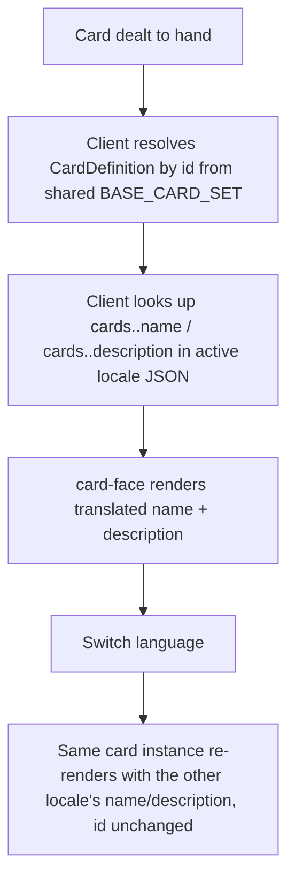
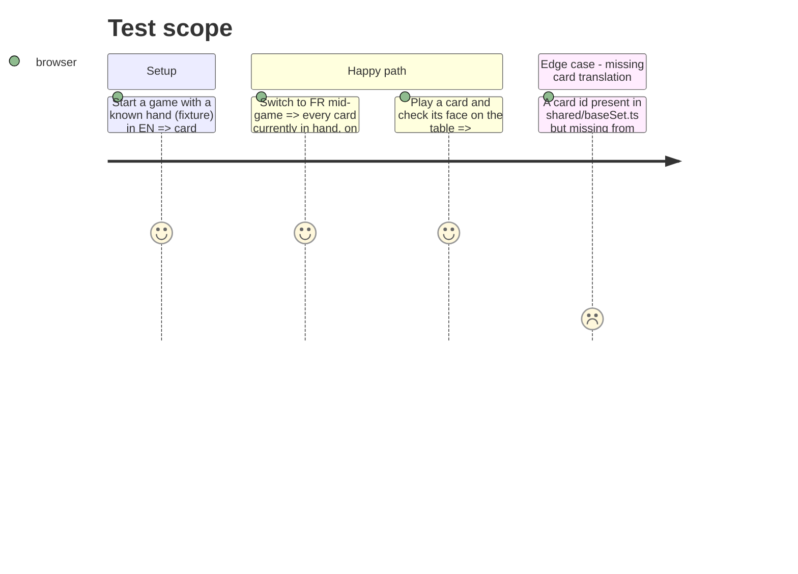

# Instruction: Card content i18n

## Architecture projection

> Tree of the final files. ✅ create · ✏️ modify · ❌ delete

```txt
.
├── shared/src/cards/
│   ├── card.ts                              ✏️ CardDefinition drops `name`/`description` (mechanical vocabulary only)
│   ├── baseSet.ts                           ✏️ entries drop `name`/`description` literals
│   └── baseSet.test.ts                      ✏️ update fixtures/assertions that referenced `.name`/`.description`
└── client/
    ├── public/i18n/
    │   ├── en.json                          ✏️ add `cards.<id>.name` / `cards.<id>.description` per card
    │   └── fr.json                          ✏️ same keys, French text (existing French copy moves here verbatim)
    └── src/app/game/
        ├── table-rules.ts                   ✏️ `getDefinition` unchanged in shape; nothing here reads name/description today (confirmed) — no change expected beyond type follow-through
        ├── card-face.ts, card-face.html     ✏️ resolve name/description via translation lookup keyed by `definition().id`, not `definition().name`
        ├── hand.ts, hand.html               ✏️ `view.definition.name` (menu-name) becomes a translated lookup by id
        └── card-face.spec.ts, game-board.spec.ts ✏️ update fixtures/assertions that hardcode a card's French name (e.g. `'Diplôme'`)
```

## User Journey



## Test Scope



## Tasks to do

### `1)` Strip display text out of the shared card vocabulary

> `CardDefinition` becomes purely mechanical; the engine never used `name`/`description` (confirmed: no `server/src` reference to either field).

1. In `shared/src/cards/card.ts`, remove `name` and `description` from `CardDefinition`.
2. In `shared/src/cards/baseSet.ts`, drop the `name`/`description` literal from each of the 14 entries, keeping `id`, `category`, and every mechanical field untouched.
3. Update `shared/src/cards/baseSet.test.ts` for whatever it asserted against those fields.
4. `pnpm --filter shared build` / `pnpm --filter shared test` to confirm the engine package still compiles and its tests pass with the narrower type.

### `2)` Add card content to the translation files

> One entry per card id, both locales.

1. In `client/public/i18n/en.json` and `fr.json`, add a `cards` namespace keyed by each of the 14 `CardDefinition.id` values from `baseSet.ts` (`job-waiter`, `job-engineer`, `job-senior-engineer`, `relationship-marriage`, `flirt-crush`, `flirt-date`, `flirt-kiss`, `bonus-infidelity`, `bonus-social-butterfly`, `child-baby`, `education-degree`, `malus-rival`, `malus-layoff`, `malus-thief`), each with `name` and `description` sub-keys.
2. Move the existing French text (already in `baseSet.ts` today) into `fr.json` verbatim; write new English translations for `en.json`.

### `3)` Point card rendering at the translation lookup

> Anywhere the client read `CardDefinition.name`/`.description` now resolves through Transloco by the card's `id`.

1. `card-face.ts`/`card-face.html`: replace `{{ definition().name }}` / `{{ definition().description }}` with a translated lookup keyed by `cards.<id>.name` / `cards.<id>.description` (e.g. a computed signal combining `definition().id` with the active lang).
2. `hand.ts`: same for the selected-card menu name.
3. Update `card-face.spec.ts` and `game-board.spec.ts` fixtures/assertions that hardcode a specific card's rendered French name (e.g. the `'Diplôme'` checks) — either load the real `en`/`fr` dict in the test bed or assert against the card `id`/a stable selector instead of the literal string.

## Test acceptance criteria

| Task | Acceptance criteria                                                                                 |
| ---- | ------------------------------------------------------------------------------------------------------ |
| 1... | `pnpm --filter shared test` passes; `CardDefinition` no longer exposes `name`/`description` in its type |
| 2... | `en.json`/`fr.json` `cards` namespace has all 14 ids in both locales                                    |
| 3... | Manually switching language mid-game re-renders every visible card's name and description correctly, for cards in hand, on table, and in the played row |
