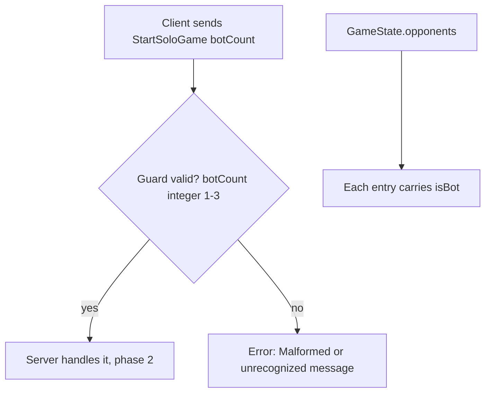
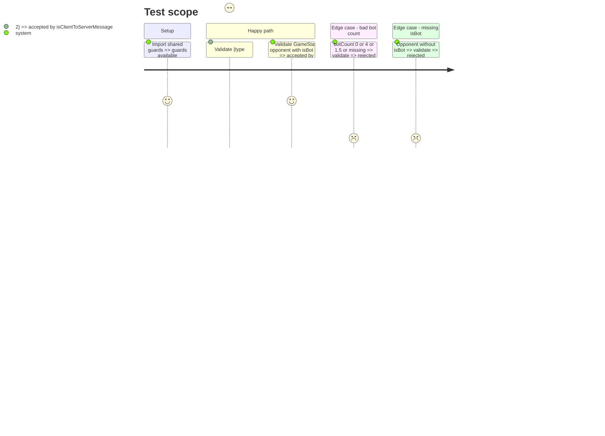

# Instruction: Shared protocol, solo start and bot flag

## Architecture projection

> Tree of the final files. ✅ create · ✏️ modify · ❌ delete

```txt
shared/src/protocol/
├── messages.ts       ✏️ StartSoloGameMessage, OpponentSummary.isBot
├── guards.ts         ✏️ isStartSoloGame, isOpponentSummary checks isBot
└── guards.test.ts    ✏️ cases for both
```

## User Journey



## Test Scope



## Tasks to do

### `1)` Add `StartSoloGame` message

> Client can ask for a room pre-seated with bots.

1. Add `StartSoloGameMessage { type: 'StartSoloGame'; botCount: number }` to `ClientToServerMessage`.
2. Add `MIN_BOTS = 1` and `MAX_BOTS = 3` exported from `shared`, so client and server share the bounds (room cap is 4 including the human).
3. Add `isStartSoloGame` (integer within bounds) and wire it into `isClientToServerMessage`.

### `2)` Flag bots in `OpponentSummary`

> Client can label AI seats without guessing from ids.

1. Add `isBot: boolean` to `OpponentSummary`.
2. Require it in `isOpponentSummary`.
3. Update existing guard fixtures and tests.

## Test acceptance criteria

| Task | Acceptance criteria                                                                 |
| ---- | ----------------------------------------------------------------------------------- |
| 1    | `StartSoloGame` with botCount 1, 2, 3 passes; 0, 4, 1.5, "2", missing all fail      |
| 2    | `GameState` with every opponent carrying boolean `isBot` passes; missing/non-boolean fails |
