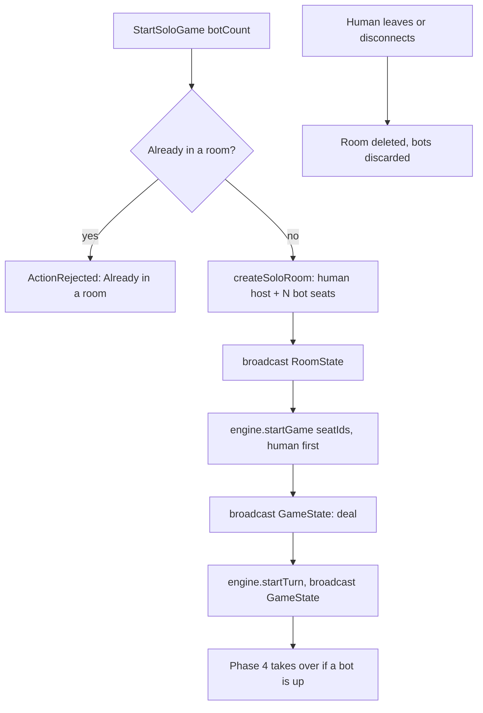
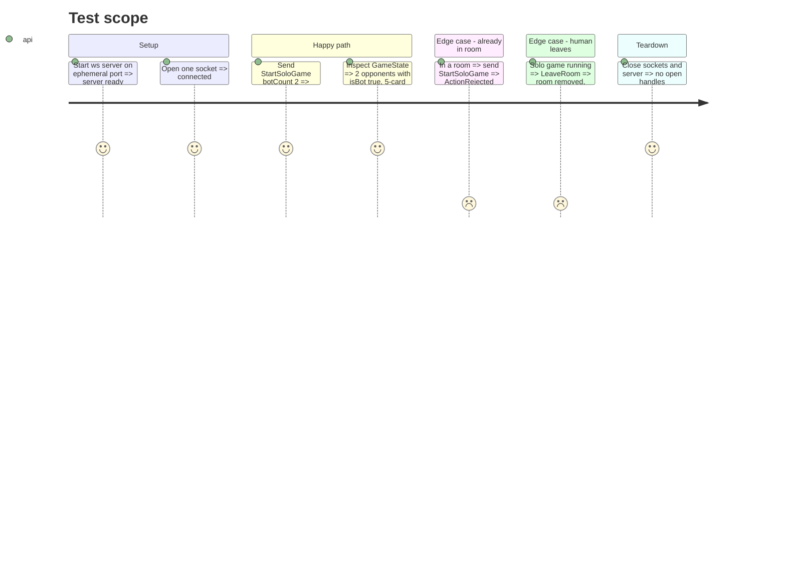

# Instruction: Server, bot seats and solo room

## Architecture projection

> Tree of the final files. ✅ create · ✏️ modify · ❌ delete

```txt
server/src/
├── rooms/
│   ├── room.ts               ✏️ botIds, seatIds, addBot; isEmpty/size stay human-based
│   ├── roomManager.ts        ✏️ createSoloRoom(playerId, ws, botCount)
│   └── roomManager.test.ts   ✏️ solo room cases
├── game/engine.ts            ✏️ OpponentSummary.isBot in toGameStateMessage (needs bot id set)
└── ws/router.ts              ✏️ StartSoloGame case
```

## User Journey



## Test Scope



## Tasks to do

### `1)` Bot seats in `Room`

> A seat with no socket that still takes part in turn order.

1. Add `botIds: Set<string>` and `addBot(id)` to `Room`; bots do not count toward `isEmpty()` (a room with only bots is dead).
2. Add `seatIds` = human ids then bot ids (turn order, human first). `MAX_PLAYERS` (4) applies to `seatIds.length`.
3. Keep `playerIds` human-only so existing broadcast loops and `RoomState.players` are unchanged for lobby logic. Decide during implementation whether `RoomState.players` should list bots; the client seat labels (phase 5) need them there so `game.playerSeat` indices still resolve.

### `2)` `createSoloRoom`

> One call builds the whole solo room.

1. `RoomManager.createSoloRoom(playerId, ws, botCount)` creates the room, seats the human, adds `botCount` bots with generated ids.

### `3)` Router `StartSoloGame`

> Solo start skips the lobby.

1. Reject if already in a room.
2. Create the solo room, set `state.roomCode`, broadcast `RoomState`.
3. Start the engine with `room.seatIds`, broadcast deal, `startTurn`, broadcast again (same two-step as `StartGame`).
4. Extract the shared start sequence from `StartGame` instead of duplicating it.

### `4)` `isBot` in broadcasts

> Clients can tell AI seats apart.

1. `GameEngine` gets the bot id set (constructor option) and sets `isBot` on each `OpponentSummary`.

## Test acceptance criteria

| Task | Acceptance criteria                                                                                   |
| ---- | ----------------------------------------------------------------------------------------------------- |
| 1    | Room with 1 human + 3 bots has `seatIds.length` 4; a 5th `addPlayer` is refused; bots-only room reports `isEmpty()` |
| 2    | `createSoloRoom` with botCount 2 yields a room with 1 human and 2 bots, registered in the manager     |
| 3    | Sending `StartSoloGame` yields `RoomState` then two `GameState` messages; a second send is rejected   |
| 4    | Human's `GameState.opponents` marks exactly the bot seats `isBot: true`                               |
