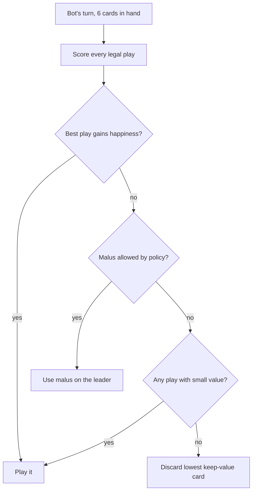
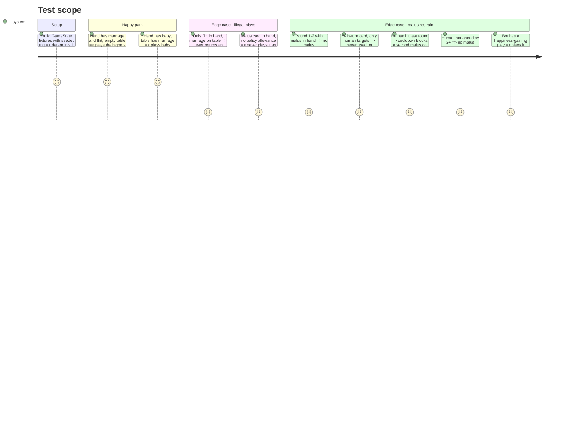

# Instruction: Server, bot strategy (pure)

## Architecture projection

> Tree of the final files. ✅ create · ✏️ modify · ❌ delete

```txt
server/src/game/
├── bot.ts        ✅ createBot(botId, rng) -> { chooseAction(state): BotAction | undefined }
├── bot.test.ts   ✅ strategy + malus policy cases
└── engine.ts     ✏️ (only if needed) read-only helper to enumerate hand/table for a seat
```

## User Journey



## Test Scope



## Tasks to do

### `1)` Enumerate legal actions

> The bot must never propose a move the engine would reject.

1. For each hand card: skip cards with a malus `effect` as table plays (the engine does not reject them, so the bot must); otherwise use `resolveUpgrade` then `canPlayCard`.
2. Malus candidates: each `effect` card x each other seat.
3. Discard candidates: each hand card (hand source only; the table-discard combo is out of scope for the bot).

### `2)` Score plays for happiness

> Maximize final happiness, the only winning metric.

1. Score = happiness delta of the resulting table (via `computeResources`, accounting for the upgrade replacement) + 0.5 x happiness of hand cards the play newly unlocks (e.g. marriage enabling baby) + a small tie-break weight on money/education.
2. Weights are named constants at the top of `bot.ts`.
3. Choose the max; break ties with the injected rng.

### `3)` Discard the least useful card

> When nothing is worth playing, keep the hand strong.

1. Keep-value: permanently blocked cards (cap reached with no bypass, excluded with no bypass in hand) and unusable malus cards rank lowest; cards unlocking future happiness rank highest.

### `4)` Lightweight malus policy

> Malus is a catch-up fallback, never harassment.

1. Constants: `MALUS_MIN_ROUND = 3`, `HUMAN_MALUS_COOLDOWN_ROUNDS = 3`, `MALUS_LEADER_GAP = 2`.
2. Allowed only if: round >= min, best play gains no happiness, target is the happiness leader, leader leads the bot by >= gap, and (for a human target) cooldown elapsed.
3. `malus-skip-turn` is never used on a human; bot-vs-bot is unrestricted by the cooldown.
4. The brain remembers the last round it hit each human (state lives in the `createBot` closure).

## Test acceptance criteria

| Task | Acceptance criteria                                                                                                  |
| ---- | -------------------------------------------------------------------------------------------------------------------- |
| 1    | Over many seeded random states, every action returned is accepted by `GameEngine.takeTurnAction`                     |
| 2    | Bot picks the highest happiness-delta legal play; an unlocking play beats an equal-delta non-unlocking one            |
| 3    | With no useful play, the discarded card is a blocked/malus card, not one that unlocks happiness                       |
| 4    | Every "malus restraint" edge case in Test Scope holds; a 10-round bot-vs-human simulation hits the human at most 3 times |
