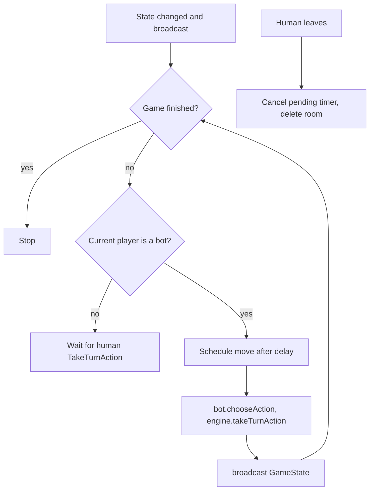
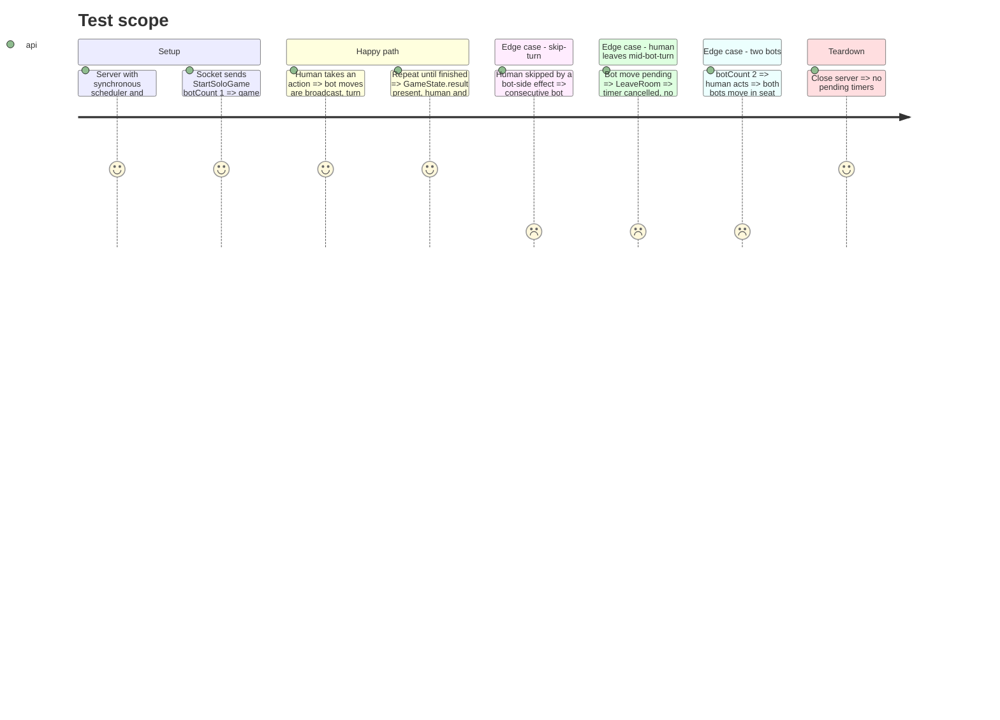

# Instruction: Server, bot turn runner

## Architecture projection

> Tree of the final files. ✅ create · ✏️ modify · ❌ delete

```txt
server/src/
├── game/botRunner.ts               ✅ runs bot turns after each state change, injectable scheduler
├── rooms/room.ts                   ✏️ holds runner handle, cancel on dispose
├── rooms/roomManager.ts            ✏️ dispose room (cancel timers) when last human leaves
├── ws/router.ts                    ✏️ call botRunner after every broadcastGameState
└── ws/soloGame.integration.test.ts ✅ full solo game over ws with sync scheduler
```

## User Journey



## Test Scope



## Tasks to do

### `1)` Bot runner

> Bots move on their own, at a human-readable pace.

1. `startBotTurns(room, scheduler, delayMs)`: if game not finished and current player is a bot, schedule one move, then re-check after it (loop until a human is up or the game ends).
2. Scheduler is injected (`(fn, ms) => cancel`); default wraps `setTimeout` with ~1000 ms. Tests pass a synchronous one.
3. The move: `bot.chooseAction`, then `engine.takeTurnAction`; on a rejected or `undefined` action fall back to discarding the first hand card, so the game can never stall.

### `2)` Wire into router

> Every state change that can hand the turn to a bot triggers the runner.

1. After each `broadcastGameState` in `StartGame`, `StartSoloGame`, and `TakeTurnAction`, call the runner.
2. Bot brains are created with the room (one per bot id) and stored on the room.

### `3)` Cleanup

> No timer outlives its room.

1. Room stores the pending cancel handle; `RoomManager.removeConnection` cancels it when the room empties of humans and deletes the room.
2. A fired timer re-checks the room still exists before acting.

## Test acceptance criteria

| Task | Acceptance criteria                                                                                    |
| ---- | ------------------------------------------------------------------------------------------------------ |
| 1    | After the human's action, the bot's move is broadcast and `turnPlayerId` returns to the human; the bot never stalls the game |
| 2    | Starting a solo game where a bot goes first-after-human works; regular multiplayer rooms behave as before (existing integration tests stay green) |
| 3    | Leaving mid-game leaves zero pending timers and produces no error on a closed socket                    |
