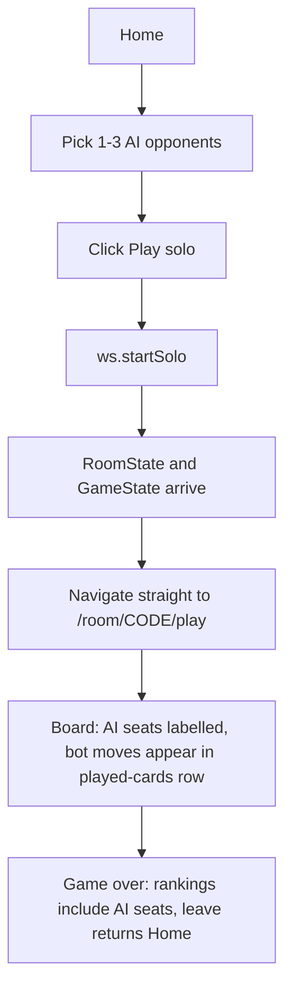
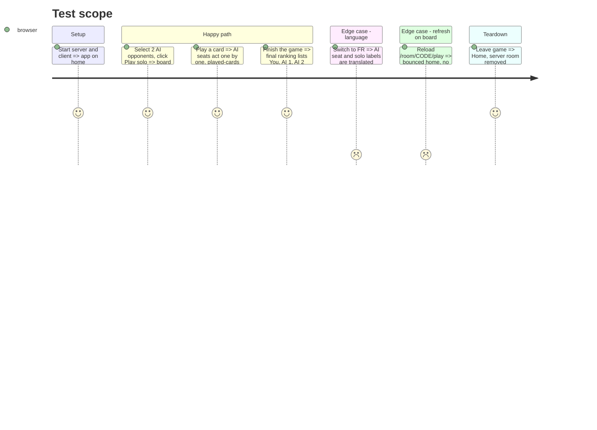

# Instruction: Client, solo entry point and bot seats

## Architecture projection

> Tree of the final files. ✅ create · ✏️ modify · ❌ delete

```txt
client/
├── public/i18n/
│   ├── en.json                       ✏️ home.solo*, game.botSeat
│   └── fr.json                       ✏️ same keys
└── src/app/
    ├── ws.service.ts                 ✏️ startSolo(botCount)
    ├── ws.service.spec.ts            ✏️ sends StartSoloGame
    ├── home/home.ts                  ✏️ botCount signal, startSolo(), navigate to /play
    ├── home/home.html                ✏️ "Play solo" card with 1-3 AI selector
    ├── home/home.spec.ts             ✏️ solo flow
    ├── game/game-board.ts            ✏️ bot seat labels ("AI 1"), always shown connected
    └── game/game-board.spec.ts       ✏️ bot label case
```

## User Journey



## Test Scope



## Wireframe

```txt
┌──────────────────────────────────┐
│ Happy Card Game                  │
│ [1] Start a room  [Create room]  │
│ [2] Join a room   [CODE][Join]   │
│ ┌──────────────────────────────┐ │
│ │ [3] Play solo                │ │
│ │ [4] Opponents: ( 1 )( 2 )( 3 )│ │
│ │ [5] [Play solo]              │ │
│ └──────────────────────────────┘ │
└──────────────────────────────────┘
```

1. Existing multiplayer cards, unchanged.
2. New card, same visual style as the others.
3. Segmented 1/2/3 selector, default 1.
4. Primary action, disabled while connecting.

## Tasks to do

### `1)` `WsService.startSolo`

> Client can request a solo game.

1. `startSolo(botCount)` sends `StartSoloGame`.

### `2)` Home solo card

> One click from Home to a running game.

1. Add `botCount` signal (default 1, bounds from `MIN_BOTS`/`MAX_BOTS` in `shared`) and the selector.
2. `startSolo()` calls the service; the existing `roomState` effect must not send solo players to the lobby: navigate to `/room/:code/play` when `gameState` is present, else `/room/:code`.

### `3)` Bot seat labels

> AI seats read as AI, not as a player id.

1. In `seatedOpponents`, when `opponent.isBot` use a `game.botSeat` label with the bot's index, and treat it as connected.
2. Turn status and final rankings reuse the same label helper so "waiting on AI 1" and the ranking match.

### `4)` i18n

> FR and EN parity.

1. Add the new keys to `en.json` and `fr.json`.

## Test acceptance criteria

| Task | Acceptance criteria                                                                          |
| ---- | -------------------------------------------------------------------------------------------- |
| 1    | Calling `startSolo(2)` writes `{type:'StartSoloGame', botCount:2}` to the socket               |
| 2    | Clicking Play solo with 3 selected sends botCount 3 and lands on the board, never the lobby; multiplayer create/join still lands in the lobby |
| 3    | Bot opponents render "AI n" labels, none shows "disconnected"; rankings and turn status use the same label |
| 4    | Both language files contain every new key; UI in FR shows no raw key                           |
